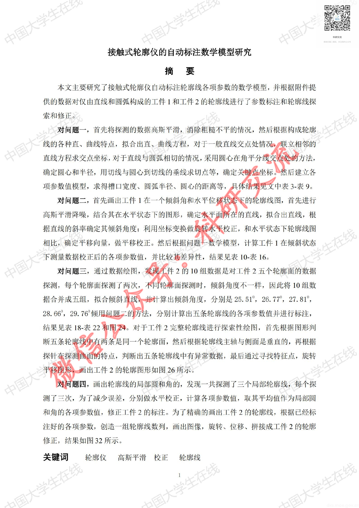
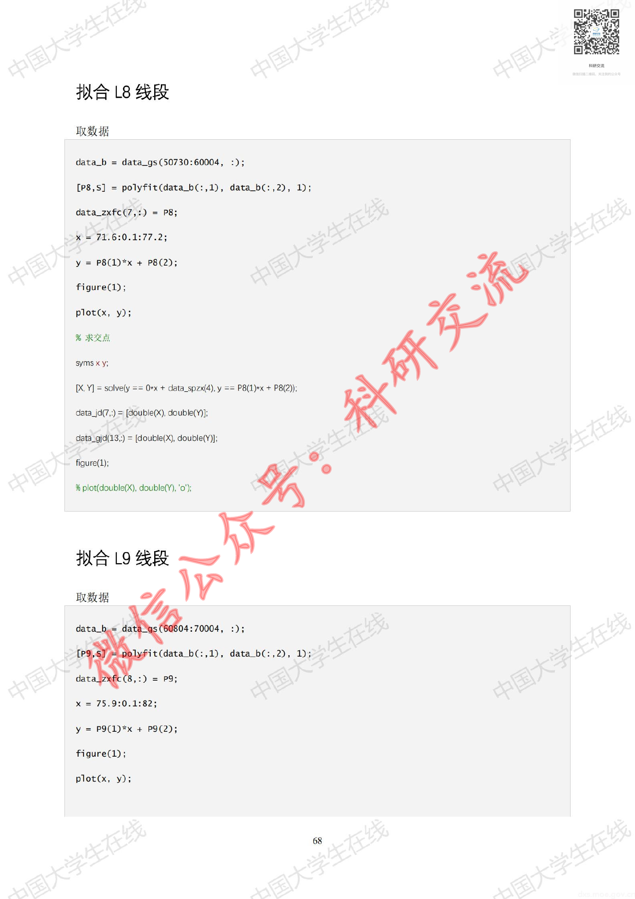
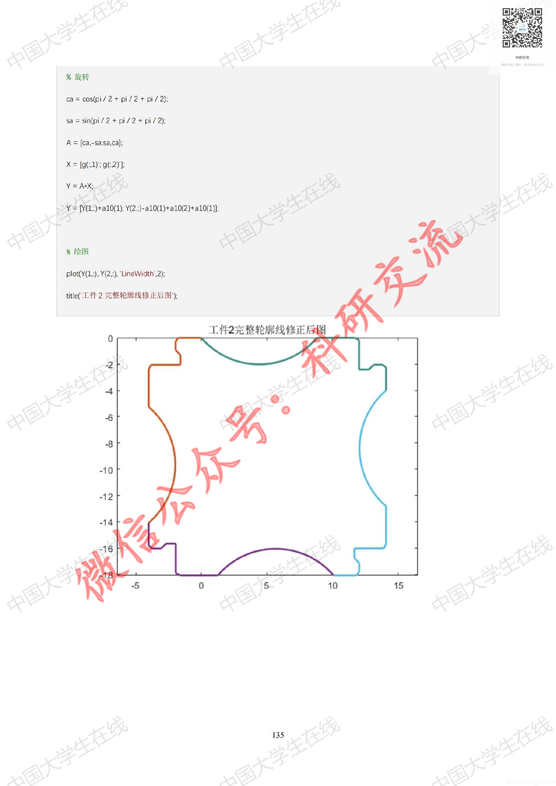

# Before / After Evidence — CUMCM-2020-D-003

This is an evidence comparison for the original G11 MAJOR finding. It is not a human decision.

## Original defective state (historical authoritative evidence)

- Original decision sheet: `catalog/scale/g11_manual_sample_decisions.csv`; sample_order `5`; severity `MAJOR`.
- Historical body SHA256 before repair: `90CA9CFE4E538A72291F2133FDF3A1B289BC8F88EC983F7DA9BB458BB1D7F559`.
- Historical packet: `reports/scale/g11_manual_sample_review/05_CUMCM-2020-D-003`.
- Original major evidence: 长篇OCR样本首/中/末页均存在并与源页面主题一致，未见明显页序错乱或末尾截断；正文和代码主体可辨，但中后部代码/符号存在局部OCR误识别。关键变量、坐标或运算符部分被改写并影响模型含义。

### Historical review unit G11-MANUAL-SAMPLE-5-PAGE-A

- Historical source render: `reports/scale/g11_manual_sample_review/05_CUMCM-2020-D-003/page_A.png`.
- Historical formal excerpt: `reports/scale/g11_manual_sample_review/05_CUMCM-2020-D-003/page_A_artifact_excerpt.txt`.
- Historical page-content SHA from triage: `E3B0C44298FC1C149AFBF4C8996FB92427AE41E4649B934CA495991B7852B855`.

<pre>
paper_id=CUMCM-2020-D-003
page_number=1
page_classification=FIRST_SUBSTANTIVE_PERSISTED_PAGE
source_path=2020年数学建模国赛真题+优秀论文/2020年优秀论文/2020D：接触式轮廓仪的自动标注数学模型研究.pdf
source_sha256=F8167387022E46E54EA04C371F75ADCF587FFD4E72C300BEB3798588C3E826A9
persisted_page_text_path=catalog/scale/g8_q3_batch_repair/CUMCM-2020-D-003/pages/0001.txt

=== PERSISTED PAGE TEXT (READ-ONLY EXISTING EVIDENCE) ===
Eig: sA 接触 式 轮廓 仪 的 自动 标注 数学 模型 研究 摘要 本 文 主要 研究 了 接触 式 轮廓 仪 自动 标注 轮廓 线 各 项 参数 的 数学 模型 ， 并 根据 附件 提 供 的 数据 对 仅 由 直线 和 圆 弧 构成 的 工件 1 和 工件 2 的 轮廓 线 进 行 了 参数 标注 和 轮廓 线 探 索 和 修正 。 对 问题 一 ， 首 先 将 探测 的 数据 高 斯 平滑 ， 消 除 粗糙 不 平 的 情况 ， 然 后 根据 构成 轮廓 线 的 各 种 直 、 曲 线 特点 ， 拟 合 出 直 、 曲 线 方程 ， 对 于 一 般 直 线 交 点 处 情 ;sy/ 联 立 相 邻 的 直线 方程 求 交 点 坐标 , 对 于 直线 与 圆 弧 相 切 的 情况 ， motnrag 失 or 确定 圆心 和 半径 ， 用 切线 与 圆心 到 切线 的 垂 线 求 切 点 等 ， 7 m 项 参数 值 模型 ， 求 得 模 口 宽度 、 圆 弧 半 径 、 圆 心 的 距离 等 ， 具 an 对 问题 二 ， 首 先 画 出 工件 1 在 一 个 倾斜 角 和 水 平 位 en 首先 进行 高 斯 平滑 降 噪 ， 结 合 其 在 水 平 状 态 下 的 图 形 ， 确定 水 平面 所 在 的 直线 ， 拟 合 出 直线 ， 根 据 直 线 的 斜率 确定 其 倾斜 角度 ， 利 用 坐标 变换 做 和 芭 校 正 ， 和 水 平 状态 下 轮廓 线 图 相 比 ， 确 定 平移 向 量 ， 做 平移 校正 。 然 后 根据 问题 二 数学 模型 ， 计 算 工件 1 在 倾斜 状态 下 测量 数据 校正 后 的 各 项 参数 值 ， 并 比较 基 差 异性 ， 结 果 见 表 10- 表 16。 对 问题 三 ， 通 过 数据 绘图 ， AR 10 组 数据 是 对 工件 2 五 个 轮廓 面 的 数据 探测 ， 每 个 轮廓 面 探测 了 两 次 ， Sa 人 6 郭 面 探测 时 ， 倾 斜 角度 不 一 样 ， 因 此 将 10 组 数 据 合并 成 五 组 ， on 困 曙 是 05 26.77°, 27.81%, 28.66°, 29. 76 倾 用 问题 却 的 方法 ， 分 别 计算 出 五 条 轮廓 线 的 各 项 参数 值 并 进行 标注

[historical excerpt clipped; source file remains authoritative]

 构成 | 抽 合 出 各 个 让、 曲线 方程 ， 计 算 其 相交 的 点 ， 然 后 建立 数学 模型 计算 工件 工 在 水 平 状态 下 测量 所 得 的 各 项 参数 。 Cr® 问题 二 : 使 工件 1 在 0 - 些 水 平平 移 状 态 下 进行 测量 ， 根 据 所 给 数据 CaaaoLaowa) ， 醒 出名 诸 图 《全 3 pe _， — 1 AAX\ Re 对 玫 | 站 ss 2 1/17 q) y W | supA 矿 % : My 人 A 由， | CC AN ~ 1 SN 0 “得 2 SS 这 | 1 Tv 2 re 图 3 工件 1 在 倾斜 和 水 平 

=== HUMAN REVIEW NOTE ===
This file prepares evidence only. It is not a human review decision.

</pre>

### Historical review unit G11-MANUAL-SAMPLE-5-PAGE-B

- Historical source render: `reports/scale/g11_manual_sample_review/05_CUMCM-2020-D-003/page_B.png`.
- Historical formal excerpt: `reports/scale/g11_manual_sample_review/05_CUMCM-2020-D-003/page_B_artifact_excerpt.txt`.
- Historical page-content SHA from triage: `E3B0C44298FC1C149AFBF4C8996FB92427AE41E4649B934CA495991B7852B855`.

<pre>
paper_id=CUMCM-2020-D-003
page_number=68
page_classification=MIDDLE_SUBSTANTIVE_PERSISTED_PAGE
source_path=2020年数学建模国赛真题+优秀论文/2020年优秀论文/2020D：接触式轮廓仪的自动标注数学模型研究.pdf
source_sha256=F8167387022E46E54EA04C371F75ADCF587FFD4E72C300BEB3798588C3E826A9
persisted_page_text_path=catalog/scale/g8_q3_batch_repair/CUMCM-2020-D-003/pages/0068.txt

=== PERSISTED PAGE TEXT (READ-ONLY EXISTING EVIDENCE) ===
EiaE 风月 二 回 呈 NS 区 心 要 拟 合 L8 线段 取 数 据 data_b = data_gs(50730:60004, :); [P8,S] = polyfitCdata_b(:,1)，data_b(:,2)，1); data_zxfc(7,:) = P8; x = 71.6:0.1:77.2; le vv iaAvA- Y y = P8CD*x + P8(2); 区 figure(1); SN 7 plot(x, y); % 求 交点 symsxy: [区 Y] = solve(y == O=x + data_spzx(4), y == P8(1)=x + P8(2); 全 data jd(7.) = [double(x), double(¥)}: data_gjd(13,) = [double(X), double(Y)]; figure(1); ® @ % plot(double(X), double(Y), '0'): 《 PaN 本 拟 合 L9 线段 一 data_bu= 人 光 [79,8] = polyfit(data_b(:,1), data_b(:,2), 1); Wa dataizxfic(8,:) = P9; x = 75.9:0.1:82; y = P9CD*x + P9(C2); figure(1); plot(x, y); 68

=== FORMAL ARTIFACT CONTEXT WINDOW ===
 > % plot(double(X), double(Y), '0"; 全 \ 3 拟 合 L7 线段 个 取 数据 data_b = data_gs(38771:40203, :); [P7,S] = polyfit(data_b(:,1), data_b(:,2), 1); 二 年 二 二 自 data_zxfc(6,:) = P7; @ x = 65.5:0.1:66.9; 《 y = P7GD*x + P7C2); figure(1); 了 plot(x, y); — % 求 交 点 和 symsx 区 三 ox + data_ spzx(4),y == P7(D)rx + PT2)); | data jd(6,)= [double(x), double(1)] data_gjd(12.) = [double(X), d

[historical excerpt clipped; source file remains authoritative]

); %plot(XY, 0); data_xyqd(5,) = X(1)Y(1)]; data_gjd(10,) = X(1)Y(1)]: IESES y = :各 X.Y] = sovely == data zxfcl6 Thxx + data zxfol62) y == 1/ ~data_zxfc(6,1):(x - 658075) - 4.4898) <, % plot(XY,0); data_xyqd(6,) = X(1)Y(1)]; &R daa_gjdd13 = KGDYGJT RX 拟 合 <c4 圆 弧 _X 瘟 XXX %A @ < = data_gs(76586:79945，:

=== HUMAN REVIEW NOTE ===
This file prepares evidence only. It is not a human review decision.

</pre>

### Historical review unit G11-MANUAL-SAMPLE-5-PAGE-C

- Historical source render: `reports/scale/g11_manual_sample_review/05_CUMCM-2020-D-003/page_C.png`.
- Historical formal excerpt: `reports/scale/g11_manual_sample_review/05_CUMCM-2020-D-003/page_C_artifact_excerpt.txt`.
- Historical page-content SHA from triage: `E3B0C44298FC1C149AFBF4C8996FB92427AE41E4649B934CA495991B7852B855`.

<pre>
paper_id=CUMCM-2020-D-003
page_number=135
page_classification=LAST_SUBSTANTIVE_PERSISTED_PAGE
source_path=2020年数学建模国赛真题+优秀论文/2020年优秀论文/2020D：接触式轮廓仪的自动标注数学模型研究.pdf
source_sha256=F8167387022E46E54EA04C371F75ADCF587FFD4E72C300BEB3798588C3E826A9
persisted_page_text_path=catalog/scale/g8_q3_batch_repair/CUMCM-2020-D-003/pages/0135.txt

=== PERSISTED PAGE TEXT (READ-ONLY EXISTING EVIDENCE) ===
EiaE 风月 机 回 呈 NS wase % 旋转 ca= cos(pi/2+pi/2+pi/2) sa=sin(pi/2+pi/2+pi/2) A = [ca-sasacal: X= [9:1); 9(.2)T; Y = AX; 2Y= Y(L)+al0(1); Y(2,)-a10(1)+a10(2)+al0(L): f ”rr OA ay AN 步 % 绘图 SN plot(Y(L,), Y(2.), LineWidth 2) 所 title( 工 件 2 完整 轮廓 线 修正 后 图 小 SS 工件 2 完整 轮廓 线 修正 司 钨 N 2 -4 -6 -8 -10 -12 -14 -16 I ( 8 ABR Wa 5 0 5 10 15 135

=== FORMAL ARTIFACT CONTEXT WINDOW ===
)+al0(2); Y(2,)-al0(L)); 从 绽 图 | -a, plot(Y(L,), Y(2.). LineWidth' 2); AN 步 -你 绘图 人行- plot(gC:,1), o(:,2)); 个 . 三 axis equal; hold on; 外 入 旋转 f | 个 ca= cosppi12+ pi/2); & @ sa=sintpi/2+pi72 A = [ca -sasacal; X= [go(03g(2 亲 — Y= Ai 和 Ce 认 。 w 绘图 下 和 > dth' 2) plot(g(:,1), 9(:,2)); axis equal; hold on; 134 EiaE 风月 机 回 呈 NS wase % 旋转 ca= cos(pi/2+pi/2+pi/2) sa=sin(pi/2+pi/2+pi/2) A = [ca-sasacal: X= [9:1); 9(.2)T; Y = AX; 2Y= Y(L)+al0(1); Y(2,)-a10(1)+a10(2)+al0(L): f ”rr OA ay AN 步 % 绘图 SN plot(Y(L,), Y(2.), LineWidth 2) 所 title( 工 件 2 完整 轮廓 线 修正 后 图 小 SS 工件 2 完整 轮廓 线 修正 司 钨 N 2 -4 -6 -8 -10 -12 -14 -16 I ( 8 ABR Wa 5 0 5 10 15 135

=== HUMAN REVIEW NOTE ===
This file prepares evidence only. It is not a human review decision.

</pre>

## Current repaired state (read-only current formal evidence)

### Current source page 1

- Current formal excerpt: `reports/scale/g11_post_repair_human_rereview/01_CUMCM-2020-D-003/current_formal_p1.md`.
- Current page segment SHA256: `03AFA362A9A027876D2162CBAF478230328CDBCE70F6D96324155E7E2C264B0C`.
- Raw current excerpt SHA256: `9B21B503DD9C54848848413CBE6B89C806EC5FF9E76F57656483A6FE164FA30C`.
- Repair evidence: `catalog/scale/g8_q3_batch_repair/CUMCM-2020-D-003/pages/0001.txt`; evidence SHA256 `03AFA362A9A027876D2162CBAF478230328CDBCE70F6D96324155E7E2C264B0C`.
- Programmatic repair validation: `postrepair_pass=1`.

### Current source page 68

- Current formal excerpt: `reports/scale/g11_post_repair_human_rereview/01_CUMCM-2020-D-003/current_formal_p68.md`.
- Current page segment SHA256: `142CF2C7D0F0C9B0BEE37467510D06835083C5096722DE00ECF15F4A36AFF298`.
- Raw current excerpt SHA256: `4780DA53F5FEA0D84BC20AA9D64104695DB5BAB9C33521758D411B63A1D2F907`.
- Repair evidence: `catalog/scale/g8_q3_batch_repair/CUMCM-2020-D-003/pages/0068.txt`; evidence SHA256 `142CF2C7D0F0C9B0BEE37467510D06835083C5096722DE00ECF15F4A36AFF298`.
- Programmatic repair validation: `postrepair_pass=1`.

### Current source page 135

- Current formal excerpt: `reports/scale/g11_post_repair_human_rereview/01_CUMCM-2020-D-003/current_formal_p135.md`.
- Current page segment SHA256: `9C7DE9A9E6208E89C1D4560EFF2028B3FCE0DDFCD1A8212874914F9925BEB804`.
- Raw current excerpt SHA256: `8CF18B2878FABA9B1EC88CCFACE97DFF706F9F057605835C08657A00C5FFF80A`.
- Repair evidence: `catalog/scale/g8_q3_batch_repair/CUMCM-2020-D-003/pages/0135.txt`; evidence SHA256 `9C7DE9A9E6208E89C1D4560EFF2028B3FCE0DDFCD1A8212874914F9925BEB804`.
- Programmatic repair validation: `postrepair_pass=1`.

The historical block is linked to the original packet evidence; the current block is extracted from the current formal `paper.md`. Human reviewers must compare the original issue with the repaired content and decide the new severity independently.

## Source Page Images

Existing historical source-render copies for the corresponding rereview units:

- `G11-MANUAL-SAMPLE-5-PAGE-A` / source page `1`: 
  - Original PNG: `reports/scale/g11_manual_sample_review/05_CUMCM-2020-D-003/page_A.png`; SHA256 `157BCFA19E053A12A497B596D59EBEB074238618C9814528FC6EA6997242CF6B`.
  - Copied PNG: `source_images/source_unit_01_p1.png`; SHA256 `157BCFA19E053A12A497B596D59EBEB074238618C9814528FC6EA6997242CF6B`.
- `G11-MANUAL-SAMPLE-5-PAGE-B` / source page `68`: 
  - Original PNG: `reports/scale/g11_manual_sample_review/05_CUMCM-2020-D-003/page_B.png`; SHA256 `978C294778D4B7753174CF85BE7E915F7696C599709284F6284BCFCAB8997DFB`.
  - Copied PNG: `source_images/source_unit_02_p68.png`; SHA256 `978C294778D4B7753174CF85BE7E915F7696C599709284F6284BCFCAB8997DFB`.
- `G11-MANUAL-SAMPLE-5-PAGE-C` / source page `135`: 
  - Original PNG: `reports/scale/g11_manual_sample_review/05_CUMCM-2020-D-003/page_C.png`; SHA256 `5E6BCE52E2EB22D0365D716465E4F244B0B3056202F7FB9CB88AFF0219293B93`.
  - Copied PNG: `source_images/source_unit_03_p135.png`; SHA256 `5E6BCE52E2EB22D0365D716465E4F244B0B3056202F7FB9CB88AFF0219293B93`.
