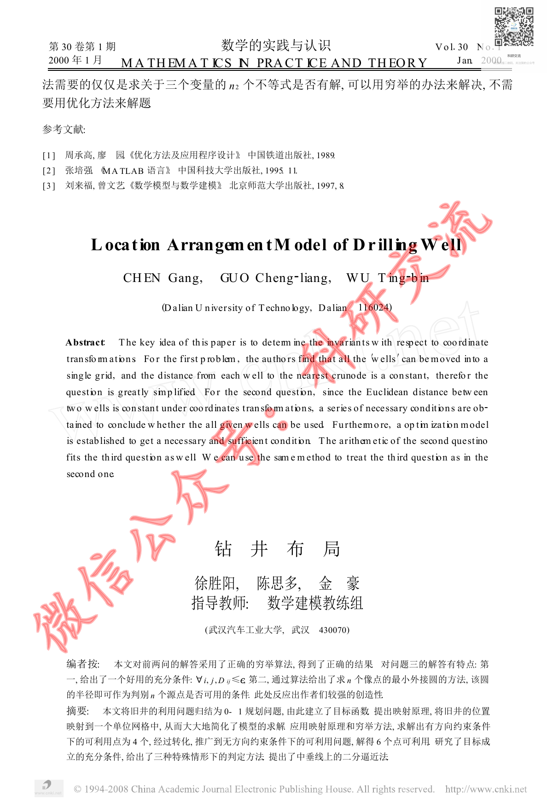
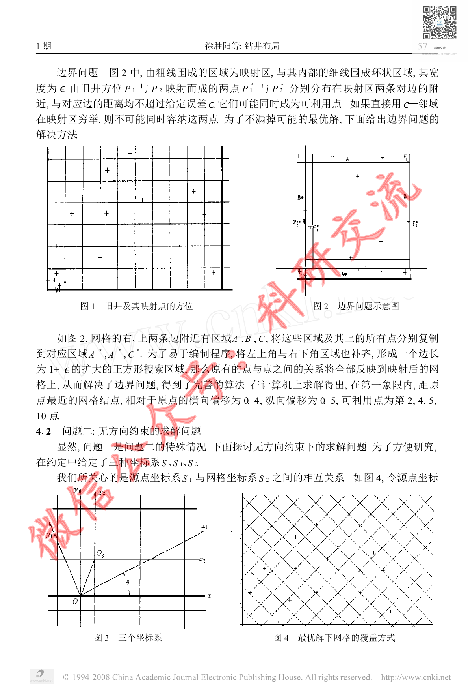
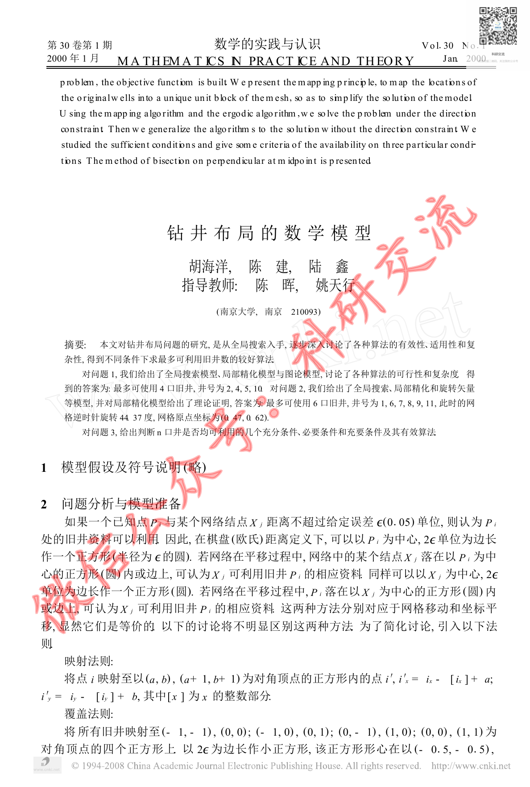

# Before / After Evidence — CUMCM-1999-B-003

This is an evidence comparison for the original G11 MAJOR finding. It is not a human decision.

## Original defective state (historical authoritative evidence)

- Original decision sheet: `catalog/scale/g11_manual_sample_decisions.csv`; sample_order `19`; severity `MAJOR`.
- Historical body SHA256 before repair: `3556B4100929F4D56319AA760B104EE0CA947F3D5B03F13F7A0DF601179225BE`.
- Historical packet: `reports/scale/g11_manual_sample_review/19_CUMCM-1999-B-003`.
- Original major evidence: 源页面明显包含实质正文、图形/数学内容，但三个artifact excerpt基本只剩# Extracted Paper和source_page页标记，没有对应正文文本。按G11“重要章节/大段内容缺失”定义，回查该governed-duplicate artifact的正文生成/绑定是否为空。

### Historical review unit G11-MANUAL-SAMPLE-19-PAGE-A

- Historical source render: `reports/scale/g11_manual_sample_review/19_CUMCM-1999-B-003/page_A.png`.
- Historical formal excerpt: `reports/scale/g11_manual_sample_review/19_CUMCM-1999-B-003/page_A_artifact_excerpt.txt`.
- Historical page-content SHA from triage: `E3B0C44298FC1C149AFBF4C8996FB92427AE41E4649B934CA495991B7852B855`.

<pre>
paper_id=CUMCM-1999-B-003
page_number=1
page_classification=FIRST_PAGE_FROM_FROZEN_PAGE_COUNT
source_path=1999年数学建模国赛真题+优秀论文/1999年国赛优秀论文/1999B：钻井布局.pdf
source_sha256=E837A050E1F8C8FBACEF5C9614A37002858951C7AD98B2E2F051456B010AC568
persisted_page_text_path=NOT_AVAILABLE_FOR_THIS_STRATUM

=== PERSISTED PAGE TEXT (READ-ONLY EXISTING EVIDENCE) ===
[No page-local persisted text is available; no new extraction was run.]

=== FORMAL ARTIFACT CONTEXT WINDOW ===
# Extracted Paper

<!-- source_page: 1 -->

<!-- source_page: 2 -->

<!-- source_page: 3 -->

<!-- source_page: 4 -->

<!-- source_page: 5 -->

<!-- source_page: 6 -->

=== HUMAN REVIEW NOTE ===
This file prepares evidence only. It is not a human review decision.

</pre>

### Historical review unit G11-MANUAL-SAMPLE-19-PAGE-B

- Historical source render: `reports/scale/g11_manual_sample_review/19_CUMCM-1999-B-003/page_B.png`.
- Historical formal excerpt: `reports/scale/g11_manual_sample_review/19_CUMCM-1999-B-003/page_B_artifact_excerpt.txt`.
- Historical page-content SHA from triage: `E3B0C44298FC1C149AFBF4C8996FB92427AE41E4649B934CA495991B7852B855`.

<pre>
paper_id=CUMCM-1999-B-003
page_number=3
page_classification=MIDDLE_PAGE_FROM_FROZEN_PAGE_COUNT
source_path=1999年数学建模国赛真题+优秀论文/1999年国赛优秀论文/1999B：钻井布局.pdf
source_sha256=E837A050E1F8C8FBACEF5C9614A37002858951C7AD98B2E2F051456B010AC568
persisted_page_text_path=NOT_AVAILABLE_FOR_THIS_STRATUM

=== PERSISTED PAGE TEXT (READ-ONLY EXISTING EVIDENCE) ===
[No page-local persisted text is available; no new extraction was run.]

=== FORMAL ARTIFACT CONTEXT WINDOW ===
ge: 2 -->

<!-- source_page: 3 -->

<!-- source_page: 4 -->

<!-- source_page: 5 -->

<!-- source_page: 6 -->

=== HUMAN REVIEW NOTE ===
This file prepares evidence only. It is not a human review decision.

</pre>

### Historical review unit G11-MANUAL-SAMPLE-19-PAGE-C

- Historical source render: `reports/scale/g11_manual_sample_review/19_CUMCM-1999-B-003/page_C.png`.
- Historical formal excerpt: `reports/scale/g11_manual_sample_review/19_CUMCM-1999-B-003/page_C_artifact_excerpt.txt`.
- Historical page-content SHA from triage: `E3B0C44298FC1C149AFBF4C8996FB92427AE41E4649B934CA495991B7852B855`.

<pre>
paper_id=CUMCM-1999-B-003
page_number=6
page_classification=LAST_PAGE_FROM_FROZEN_PAGE_COUNT
source_path=1999年数学建模国赛真题+优秀论文/1999年国赛优秀论文/1999B：钻井布局.pdf
source_sha256=E837A050E1F8C8FBACEF5C9614A37002858951C7AD98B2E2F051456B010AC568
persisted_page_text_path=NOT_AVAILABLE_FOR_THIS_STRATUM

=== PERSISTED PAGE TEXT (READ-ONLY EXISTING EVIDENCE) ===
[No page-local persisted text is available; no new extraction was run.]

=== FORMAL ARTIFACT CONTEXT WINDOW ===

<!-- source_page: 6 -->

=== HUMAN REVIEW NOTE ===
This file prepares evidence only. It is not a human review decision.

</pre>

## Current repaired state (read-only current formal evidence)

### Current source page 1

- Current formal excerpt: `reports/scale/g11_post_repair_human_rereview/02_CUMCM-1999-B-003/current_formal_p1.md`.
- Current page segment SHA256: `2C1A77CF165B637D17E4FE9F221CD661874F28CABE6EF33ECFED08CD2EF83133`.
- Raw current excerpt SHA256: `55BCFDF7231FE9E55736EAC381C2C3B2928D85940340A0ED9DB49D5A190F2547`.
- Repair evidence: `catalog/scale/g11_residual_pdftotext_calibration/positive/CUMCM-1999-B-003/source_page_1.txt`; evidence SHA256 `1C8B3BD51D16C1BC766D8A4B2B141E44E908BAF180B54338F2DA44E7E79AF5B4`.
- Programmatic repair validation: `postrepair_pass=1`.

### Current source page 3

- Current formal excerpt: `reports/scale/g11_post_repair_human_rereview/02_CUMCM-1999-B-003/current_formal_p3.md`.
- Current page segment SHA256: `287E7614BB939A5263DF25A1DBAC7664F0B1C78CA9CA410682D53ED6D406337C`.
- Raw current excerpt SHA256: `DFD759564FE66B93AD0AE047A3D691C44AEDEE61B35271FA73ABC6AEA290AB6C`.
- Repair evidence: `catalog/scale/g11_residual_pdftotext_calibration/positive/CUMCM-1999-B-003/source_page_3.txt`; evidence SHA256 `1746E951588337BD276211C7C52CC3A85B156E03AB6DC6768DA024F4BE920420`.
- Programmatic repair validation: `postrepair_pass=1`.

### Current source page 6

- Current formal excerpt: `reports/scale/g11_post_repair_human_rereview/02_CUMCM-1999-B-003/current_formal_p6.md`.
- Current page segment SHA256: `C9829109AC7FFF5305D92EDD2E731644F658C6F7CF70B95C5A0B2DA7DF4FB425`.
- Raw current excerpt SHA256: `1C857AD36A28F36D407ED0471C1252AB2299A257AEEBE7B7FC162AB2F399C42A`.
- Repair evidence: `catalog/scale/g11_residual_pdftotext_calibration/positive/CUMCM-1999-B-003/source_page_6.txt`; evidence SHA256 `F437567E345976121886FB829000A314A3D17768BED980B2E8818329DB0355DA`.
- Programmatic repair validation: `postrepair_pass=1`.

The historical block is linked to the original packet evidence; the current block is extracted from the current formal `paper.md`. Human reviewers must compare the original issue with the repaired content and decide the new severity independently.

## Source Page Images

Existing historical source-render copies for the corresponding rereview units:

- `G11-MANUAL-SAMPLE-19-PAGE-A` / source page `1`: 
  - Original PNG: `reports/scale/g11_manual_sample_review/19_CUMCM-1999-B-003/page_A.png`; SHA256 `3FD84DB817A66C0895D1459A81D12DDAE19CB65E61C954217536493DCA0CE587`.
  - Copied PNG: `source_images/source_unit_01_p1.png`; SHA256 `3FD84DB817A66C0895D1459A81D12DDAE19CB65E61C954217536493DCA0CE587`.
- `G11-MANUAL-SAMPLE-19-PAGE-B` / source page `3`: 
  - Original PNG: `reports/scale/g11_manual_sample_review/19_CUMCM-1999-B-003/page_B.png`; SHA256 `C0AB0C7BC265567EFB69D5BBF540594E73BFAD71B167677656B91545C108C546`.
  - Copied PNG: `source_images/source_unit_02_p3.png`; SHA256 `C0AB0C7BC265567EFB69D5BBF540594E73BFAD71B167677656B91545C108C546`.
- `G11-MANUAL-SAMPLE-19-PAGE-C` / source page `6`: 
  - Original PNG: `reports/scale/g11_manual_sample_review/19_CUMCM-1999-B-003/page_C.png`; SHA256 `98C21EBBF34CBE6249B35ED85A4B5826AE6B62DCC8063E01422CC0720995B7DA`.
  - Copied PNG: `source_images/source_unit_03_p6.png`; SHA256 `98C21EBBF34CBE6249B35ED85A4B5826AE6B62DCC8063E01422CC0720995B7DA`.
