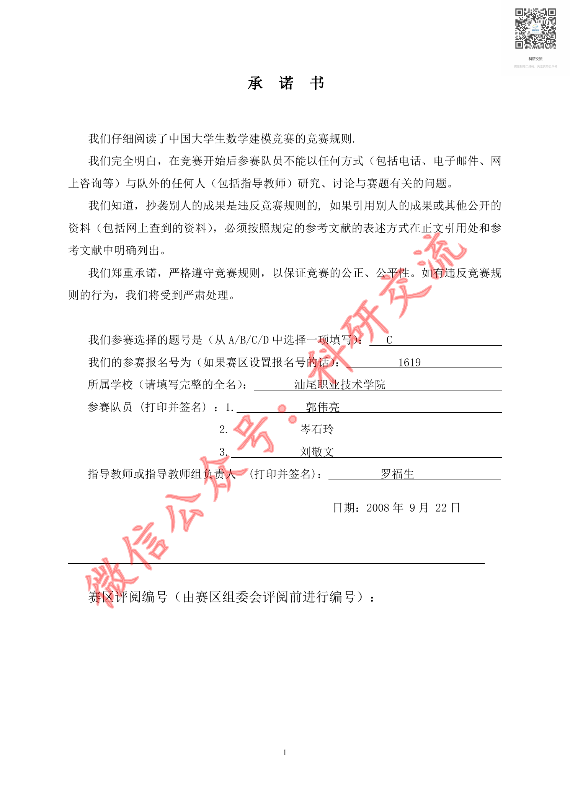
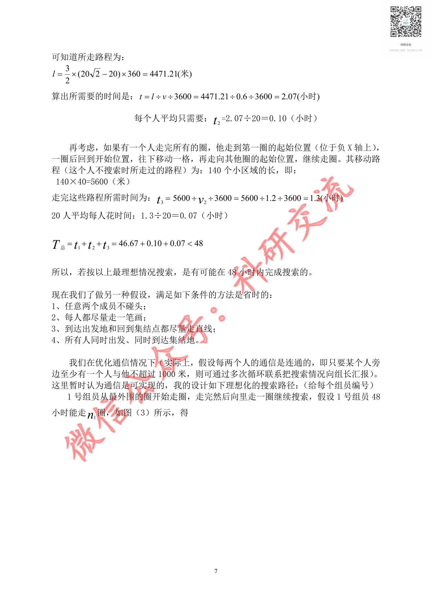
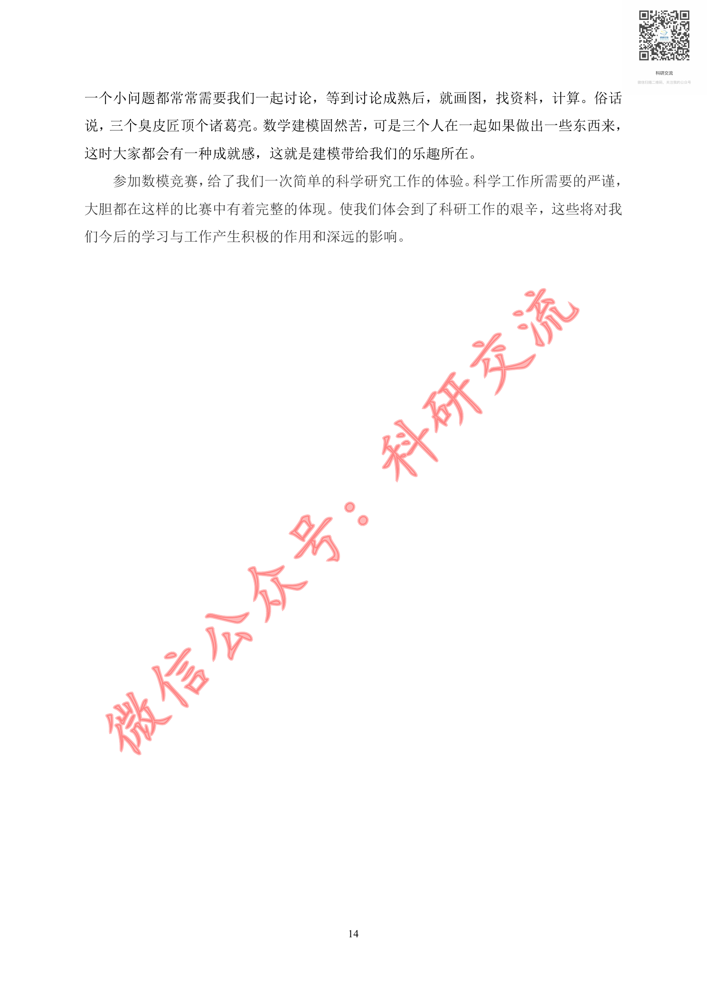

# Before / After Evidence — CUMCM-2008-C-004

This is an evidence comparison for the original G11 MAJOR finding. It is not a human decision.

## Original defective state (historical authoritative evidence)

- Original decision sheet: `catalog/scale/g11_manual_sample_decisions.csv`; sample_order `20`; severity `MAJOR`.
- Historical body SHA256 before repair: `F501017C13D9B29686DD922D65EDC0CD658E90E82A5785E427A2D829537C8626`.
- Historical packet: `reports/scale/g11_manual_sample_review/20_CUMCM-2008-C-004`.
- Original major evidence: 源页面包含连续正文和公式/模型内容，但artifact excerpt仅有页码标记，未提供对应正文，存在明显实质内容缺失。建议检查formal artifact是否生成了空正文。

### Historical review unit G11-MANUAL-SAMPLE-20-PAGE-A

- Historical source render: `reports/scale/g11_manual_sample_review/20_CUMCM-2008-C-004/page_A.png`.
- Historical formal excerpt: `reports/scale/g11_manual_sample_review/20_CUMCM-2008-C-004/page_A_artifact_excerpt.txt`.
- Historical page-content SHA from triage: `E3B0C44298FC1C149AFBF4C8996FB92427AE41E4649B934CA495991B7852B855`.

<pre>
paper_id=CUMCM-2008-C-004
page_number=1
page_classification=FIRST_PAGE_FROM_FROZEN_PAGE_COUNT
source_path=2008年数学建模国赛真题+优秀论文/2008年优秀论文/2008C：《地面搜索的优化模型》.pdf
source_sha256=73FEE41DA723C0FA080D0E3050B8585405510151FB6AEF69FEE292972D29F045
persisted_page_text_path=NOT_AVAILABLE_FOR_THIS_STRATUM

=== PERSISTED PAGE TEXT (READ-ONLY EXISTING EVIDENCE) ===
[No page-local persisted text is available; no new extraction was run.]

=== FORMAL ARTIFACT CONTEXT WINDOW ===
# Extracted Paper

<!-- source_page: 1 -->

<!-- source_page: 2 -->

<!-- source_page: 3 -->

<!-- source_page: 4 -->

<!-- source_page: 5 -->

<!-- source_page: 6 -->

<!-- source_page: 7 -->

<!-- source_page: 8 -->

<!-- source_page: 9 -->

<!-- source_page: 10 -->

<!-- source_page: 11 -->

<!-- source_page: 12 -->

<!-- source_page: 13 -->

<!-- source_page: 14 -->

=== HUMAN REVIEW NOTE ===
This file prepares evidence only. It is not a human review decision.

</pre>

### Historical review unit G11-MANUAL-SAMPLE-20-PAGE-B

- Historical source render: `reports/scale/g11_manual_sample_review/20_CUMCM-2008-C-004/page_B.png`.
- Historical formal excerpt: `reports/scale/g11_manual_sample_review/20_CUMCM-2008-C-004/page_B_artifact_excerpt.txt`.
- Historical page-content SHA from triage: `E3B0C44298FC1C149AFBF4C8996FB92427AE41E4649B934CA495991B7852B855`.

<pre>
paper_id=CUMCM-2008-C-004
page_number=7
page_classification=MIDDLE_PAGE_FROM_FROZEN_PAGE_COUNT
source_path=2008年数学建模国赛真题+优秀论文/2008年优秀论文/2008C：《地面搜索的优化模型》.pdf
source_sha256=73FEE41DA723C0FA080D0E3050B8585405510151FB6AEF69FEE292972D29F045
persisted_page_text_path=NOT_AVAILABLE_FOR_THIS_STRATUM

=== PERSISTED PAGE TEXT (READ-ONLY EXISTING EVIDENCE) ===
[No page-local persisted text is available; no new extraction was run.]

=== FORMAL ARTIFACT CONTEXT WINDOW ===
 6 -->

<!-- source_page: 7 -->

<!-- source_page: 8 -->

<!-- source_page: 9 -->

<!-- source_page: 10 -->

<!-- source_page: 11 -->

<!-- source_page: 12 -->

<!-- source_page: 13 -->

<!-- source_page: 14 -->

=== HUMAN REVIEW NOTE ===
This file prepares evidence only. It is not a human review decision.

</pre>

### Historical review unit G11-MANUAL-SAMPLE-20-PAGE-C

- Historical source render: `reports/scale/g11_manual_sample_review/20_CUMCM-2008-C-004/page_C.png`.
- Historical formal excerpt: `reports/scale/g11_manual_sample_review/20_CUMCM-2008-C-004/page_C_artifact_excerpt.txt`.
- Historical page-content SHA from triage: `E3B0C44298FC1C149AFBF4C8996FB92427AE41E4649B934CA495991B7852B855`.

<pre>
paper_id=CUMCM-2008-C-004
page_number=14
page_classification=LAST_PAGE_FROM_FROZEN_PAGE_COUNT
source_path=2008年数学建模国赛真题+优秀论文/2008年优秀论文/2008C：《地面搜索的优化模型》.pdf
source_sha256=73FEE41DA723C0FA080D0E3050B8585405510151FB6AEF69FEE292972D29F045
persisted_page_text_path=NOT_AVAILABLE_FOR_THIS_STRATUM

=== PERSISTED PAGE TEXT (READ-ONLY EXISTING EVIDENCE) ===
[No page-local persisted text is available; no new extraction was run.]

=== FORMAL ARTIFACT CONTEXT WINDOW ===

<!-- source_page: 14 -->

=== HUMAN REVIEW NOTE ===
This file prepares evidence only. It is not a human review decision.

</pre>

## Current repaired state (read-only current formal evidence)

### Current source page 1

- Current formal excerpt: `reports/scale/g11_post_repair_human_rereview/03_CUMCM-2008-C-004/current_formal_p1.md`.
- Current page segment SHA256: `B803DF42E21AB0A17D60EA5590E8D4E0D11B174077D824A1F7D4E57873648C27`.
- Raw current excerpt SHA256: `0EC19C054DC6788BA4666804F8A95ADD498BDD05A9992DC29F39437B51B2ADA7`.
- Repair evidence: `catalog/scale/g11_residual_pdftotext_calibration/positive/CUMCM-2008-C-004/source_page_1.txt`; evidence SHA256 `51E41A9E4676686F91457654879DCC71C9382B0AC7DFE74F4E6C6BB723D3DA23`.
- Programmatic repair validation: `postrepair_pass=1`.

### Current source page 7

- Current formal excerpt: `reports/scale/g11_post_repair_human_rereview/03_CUMCM-2008-C-004/current_formal_p7.md`.
- Current page segment SHA256: `BBDA6FCA3947E16AEE50DDDC9B4C9946517F012481B475AE1DB8A5630F5BB14A`.
- Raw current excerpt SHA256: `1915AC3BCD2F552FC7D02012E16AB04578DFB9A2D8FE39BD63C7B09DAA0A2BDD`.
- Repair evidence: `catalog/scale/g11_residual_pdftotext_calibration/positive/CUMCM-2008-C-004/source_page_7.txt`; evidence SHA256 `F358177AAC1B3FC45162860B0A2F05DBC01FF737DD8FD716ABE09822CCD94114`.
- Programmatic repair validation: `postrepair_pass=1`.

### Current source page 14

- Current formal excerpt: `reports/scale/g11_post_repair_human_rereview/03_CUMCM-2008-C-004/current_formal_p14.md`.
- Current page segment SHA256: `59106338D441833171B3B83E5D4ED665E6D2A66F41DA2BD661ABCFE52245230A`.
- Raw current excerpt SHA256: `49AB027FC3E22129CBC673B86A71287414A216ADBF57DE331D4876C4CB97CF16`.
- Repair evidence: `catalog/scale/g11_residual_pdftotext_calibration/positive/CUMCM-2008-C-004/source_page_14.txt`; evidence SHA256 `00B45AEA92F6883138C5E1F85927321E7FF6FE2F5A36BF9C81A3A99563940FF8`.
- Programmatic repair validation: `postrepair_pass=1`.

The historical block is linked to the original packet evidence; the current block is extracted from the current formal `paper.md`. Human reviewers must compare the original issue with the repaired content and decide the new severity independently.

## Source Page Images

Existing historical source-render copies for the corresponding rereview units:

- `G11-MANUAL-SAMPLE-20-PAGE-A` / source page `1`: 
  - Original PNG: `reports/scale/g11_manual_sample_review/20_CUMCM-2008-C-004/page_A.png`; SHA256 `44597F70AFFEDAC45B9E5240BF5D653CF139D22C48AAB56A34A14F4E7DCFB12F`.
  - Copied PNG: `source_images/source_unit_01_p1.png`; SHA256 `44597F70AFFEDAC45B9E5240BF5D653CF139D22C48AAB56A34A14F4E7DCFB12F`.
- `G11-MANUAL-SAMPLE-20-PAGE-B` / source page `7`: 
  - Original PNG: `reports/scale/g11_manual_sample_review/20_CUMCM-2008-C-004/page_B.png`; SHA256 `75ACFACD79911537DA7D4104307E1716C444D32154AACF17807F1D0B2F4BCDE7`.
  - Copied PNG: `source_images/source_unit_02_p7.png`; SHA256 `75ACFACD79911537DA7D4104307E1716C444D32154AACF17807F1D0B2F4BCDE7`.
- `G11-MANUAL-SAMPLE-20-PAGE-C` / source page `14`: 
  - Original PNG: `reports/scale/g11_manual_sample_review/20_CUMCM-2008-C-004/page_C.png`; SHA256 `4F4D85E9C0D7322D3336C09A511AE0812DFF264A33A0A4721F8F0D155A6BB5DB`.
  - Copied PNG: `source_images/source_unit_03_p14.png`; SHA256 `4F4D85E9C0D7322D3336C09A511AE0812DFF264A33A0A4721F8F0D155A6BB5DB`.
