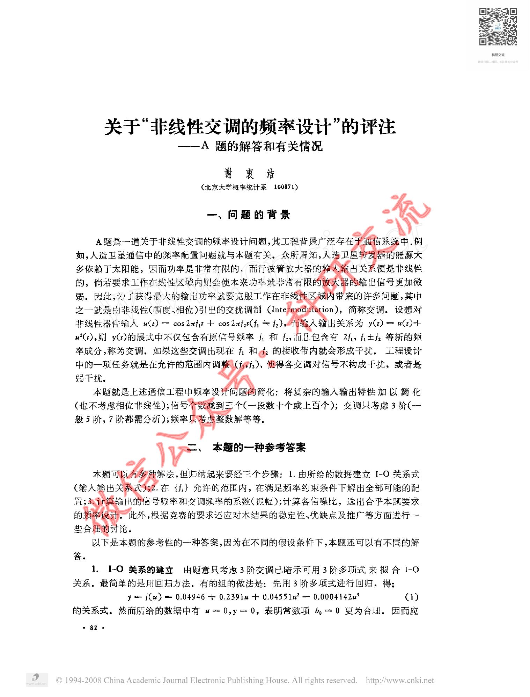
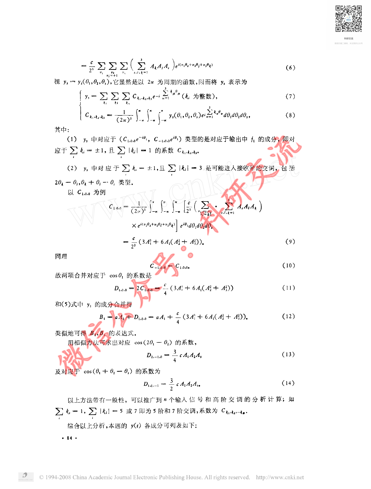
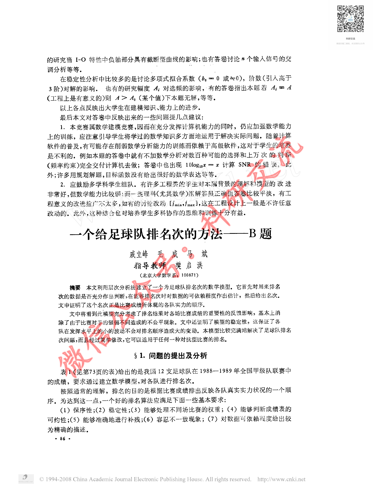

# Before / After Evidence — CUMCM-1992-A-003

This is an evidence comparison for the original G11 MAJOR finding. It is not a human decision.

## Original defective state (historical authoritative evidence)

- Original decision sheet: `catalog/scale/g11_manual_sample_decisions.csv`; sample_order `23`; severity `MAJOR`.
- Historical body SHA256 before repair: `1D9182549363CD07A8F3D657C2AD60D5197D3991577AD22ACB1BFC0A2C456E59`.
- Historical packet: `reports/scale/g11_manual_sample_review/23_CUMCM-1992-A-003`.
- Original major evidence: 源页面有连续正文和大量公式，但artifact excerpt只包含source_page标记，没有实际论文文本。属于明显大段内容缺失，建议回查formal artifact正文是否为空。

### Historical review unit G11-MANUAL-SAMPLE-23-PAGE-A

- Historical source render: `reports/scale/g11_manual_sample_review/23_CUMCM-1992-A-003/page_A.png`.
- Historical formal excerpt: `reports/scale/g11_manual_sample_review/23_CUMCM-1992-A-003/page_A_artifact_excerpt.txt`.
- Historical page-content SHA from triage: `E3B0C44298FC1C149AFBF4C8996FB92427AE41E4649B934CA495991B7852B855`.

<pre>
paper_id=CUMCM-1992-A-003
page_number=1
page_classification=FIRST_PAGE_FROM_FROZEN_PAGE_COUNT
source_path=1992年数学建模国赛优秀论文/1992年A题优秀论文③ 关于非线性交调的频率设计的评注.pdf
source_sha256=F24E48AE1113A02C6ADCF3339392D8B2C9A1449BE1A64FB2DE3D8543A8066E12
persisted_page_text_path=NOT_AVAILABLE_FOR_THIS_STRATUM

=== PERSISTED PAGE TEXT (READ-ONLY EXISTING EVIDENCE) ===
[No page-local persisted text is available; no new extraction was run.]

=== FORMAL ARTIFACT CONTEXT WINDOW ===
# Extracted Paper

<!-- source_page: 1 -->

<!-- source_page: 2 -->

<!-- source_page: 3 -->

<!-- source_page: 4 -->

<!-- source_page: 5 -->

=== HUMAN REVIEW NOTE ===
This file prepares evidence only. It is not a human review decision.

</pre>

### Historical review unit G11-MANUAL-SAMPLE-23-PAGE-B

- Historical source render: `reports/scale/g11_manual_sample_review/23_CUMCM-1992-A-003/page_B.png`.
- Historical formal excerpt: `reports/scale/g11_manual_sample_review/23_CUMCM-1992-A-003/page_B_artifact_excerpt.txt`.
- Historical page-content SHA from triage: `E3B0C44298FC1C149AFBF4C8996FB92427AE41E4649B934CA495991B7852B855`.

<pre>
paper_id=CUMCM-1992-A-003
page_number=3
page_classification=MIDDLE_PAGE_FROM_FROZEN_PAGE_COUNT
source_path=1992年数学建模国赛优秀论文/1992年A题优秀论文③ 关于非线性交调的频率设计的评注.pdf
source_sha256=F24E48AE1113A02C6ADCF3339392D8B2C9A1449BE1A64FB2DE3D8543A8066E12
persisted_page_text_path=NOT_AVAILABLE_FOR_THIS_STRATUM

=== PERSISTED PAGE TEXT (READ-ONLY EXISTING EVIDENCE) ===
[No page-local persisted text is available; no new extraction was run.]

=== FORMAL ARTIFACT CONTEXT WINDOW ===
e: 2 -->

<!-- source_page: 3 -->

<!-- source_page: 4 -->

<!-- source_page: 5 -->

=== HUMAN REVIEW NOTE ===
This file prepares evidence only. It is not a human review decision.

</pre>

### Historical review unit G11-MANUAL-SAMPLE-23-PAGE-C

- Historical source render: `reports/scale/g11_manual_sample_review/23_CUMCM-1992-A-003/page_C.png`.
- Historical formal excerpt: `reports/scale/g11_manual_sample_review/23_CUMCM-1992-A-003/page_C_artifact_excerpt.txt`.
- Historical page-content SHA from triage: `E3B0C44298FC1C149AFBF4C8996FB92427AE41E4649B934CA495991B7852B855`.

<pre>
paper_id=CUMCM-1992-A-003
page_number=5
page_classification=LAST_PAGE_FROM_FROZEN_PAGE_COUNT
source_path=1992年数学建模国赛优秀论文/1992年A题优秀论文③ 关于非线性交调的频率设计的评注.pdf
source_sha256=F24E48AE1113A02C6ADCF3339392D8B2C9A1449BE1A64FB2DE3D8543A8066E12
persisted_page_text_path=NOT_AVAILABLE_FOR_THIS_STRATUM

=== PERSISTED PAGE TEXT (READ-ONLY EXISTING EVIDENCE) ===
[No page-local persisted text is available; no new extraction was run.]

=== FORMAL ARTIFACT CONTEXT WINDOW ===
>

<!-- source_page: 5 -->

=== HUMAN REVIEW NOTE ===
This file prepares evidence only. It is not a human review decision.

</pre>

## Current repaired state (read-only current formal evidence)

### Current source page 1

- Current formal excerpt: `reports/scale/g11_post_repair_human_rereview/04_CUMCM-1992-A-003/current_formal_p1.md`.
- Current page segment SHA256: `B2937750CB38BE36928CA66529893F931ADA2BFC66169507FE52229E219ED403`.
- Raw current excerpt SHA256: `09E645A13C738D0372DF23924A41E05120B53426C247BBEE592DCD56FFD5641E`.
- Repair evidence: `catalog/scale/g11_residual_pdftotext_calibration/positive/CUMCM-1992-A-003/source_page_1.txt`; evidence SHA256 `D130605619930107074D5EBE6960F399C79251E62EEB011C10F9E6492FB8176A`.
- Programmatic repair validation: `postrepair_pass=1`.

### Current source page 3

- Current formal excerpt: `reports/scale/g11_post_repair_human_rereview/04_CUMCM-1992-A-003/current_formal_p3.md`.
- Current page segment SHA256: `EAABA4216D8F6480C511C62C3DBB561CF53019D6CF34D747A5FCEEAA84A54FE6`.
- Raw current excerpt SHA256: `58BDD851C8CF690EE0E75F5DE0EEDD91E1C85F8419C73408828ABA820E27D8B9`.
- Repair evidence: `catalog/scale/g11_residual_pdftotext_calibration/positive/CUMCM-1992-A-003/source_page_3.txt`; evidence SHA256 `57AD07207BD12E59F3FBE9DAC3573A45C53165EEFA3149D1315685A1FCD71B84`.
- Programmatic repair validation: `postrepair_pass=1`.

### Current source page 5

- Current formal excerpt: `reports/scale/g11_post_repair_human_rereview/04_CUMCM-1992-A-003/current_formal_p5.md`.
- Current page segment SHA256: `FEC72D0FCF7FB2D22B574AB1A51C1808121B7A52F946A58E24FF9A14852707CA`.
- Raw current excerpt SHA256: `79F05B06E3D8D4D081EE4A30C1DF3524DDD2B2A39E1D44082E8D5F9C259A3823`.
- Repair evidence: `catalog/scale/g11_residual_pdftotext_calibration/positive/CUMCM-1992-A-003/source_page_5.txt`; evidence SHA256 `DD275BE7B27E5A0482919DB6E85EACB515324449677A2C06DF9ADBF6677539EA`.
- Programmatic repair validation: `postrepair_pass=1`.

The historical block is linked to the original packet evidence; the current block is extracted from the current formal `paper.md`. Human reviewers must compare the original issue with the repaired content and decide the new severity independently.

## Source Page Images

Existing historical source-render copies for the corresponding rereview units:

- `G11-MANUAL-SAMPLE-23-PAGE-A` / source page `1`: 
  - Original PNG: `reports/scale/g11_manual_sample_review/23_CUMCM-1992-A-003/page_A.png`; SHA256 `4B123005C3726B3F69725C18FC53DD86B39B74D8693FBD7DA263CBA97936437F`.
  - Copied PNG: `source_images/source_unit_01_p1.png`; SHA256 `4B123005C3726B3F69725C18FC53DD86B39B74D8693FBD7DA263CBA97936437F`.
- `G11-MANUAL-SAMPLE-23-PAGE-B` / source page `3`: 
  - Original PNG: `reports/scale/g11_manual_sample_review/23_CUMCM-1992-A-003/page_B.png`; SHA256 `46616F3189AAD1C1E6AFFC2098CD6FB9B4E7C59878AE048958473B1ADC431EA1`.
  - Copied PNG: `source_images/source_unit_02_p3.png`; SHA256 `46616F3189AAD1C1E6AFFC2098CD6FB9B4E7C59878AE048958473B1ADC431EA1`.
- `G11-MANUAL-SAMPLE-23-PAGE-C` / source page `5`: 
  - Original PNG: `reports/scale/g11_manual_sample_review/23_CUMCM-1992-A-003/page_C.png`; SHA256 `6E01C39E4C1DC0F2F5F88A348AEA7FA7DA0C7EB177068691A79417FA9094CA72`.
  - Copied PNG: `source_images/source_unit_03_p5.png`; SHA256 `6E01C39E4C1DC0F2F5F88A348AEA7FA7DA0C7EB177068691A79417FA9094CA72`.
