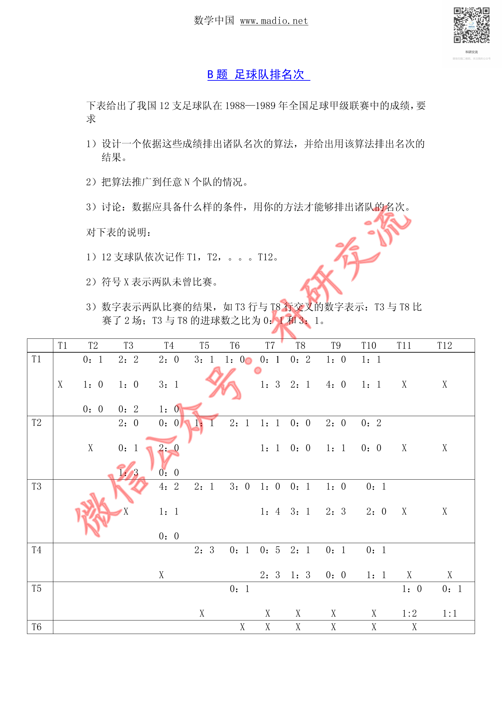
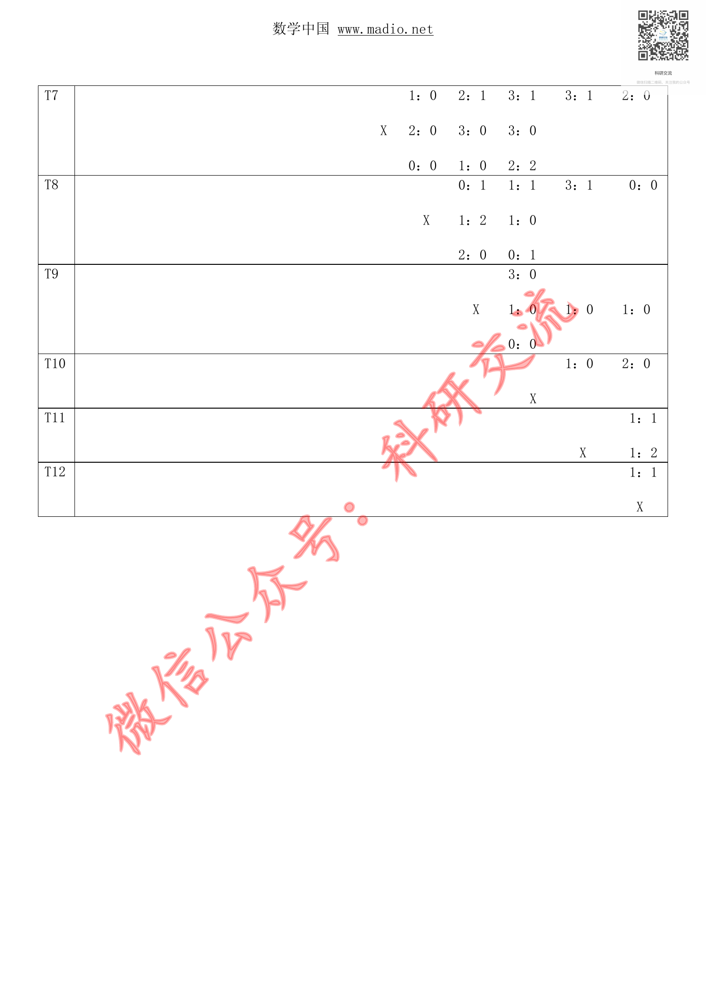

# Before / After Evidence — CUMCM-1993-B-001

This is an evidence comparison for the original G11 MAJOR finding. It is not a human decision.

## Original defective state (historical authoritative evidence)

- Original decision sheet: `catalog/scale/g11_manual_sample_decisions.csv`; sample_order `24`; severity `MAJOR`.
- Historical body SHA256 before repair: `96063CBA314A4F2CBA5DBE2319045D111F6D07789F83372C519D124C7AA4C1B2`.
- Historical packet: `reports/scale/g11_manual_sample_review/24_CUMCM-1993-B-001`.
- Original major evidence: 源页面可见正文和表格/排名数据，但artifact excerpt仅有页码标记，实际正文为空，无法完成内容连续性、文字可读性和表格内容核验。

### Historical review unit G11-MANUAL-SAMPLE-24-PAGE-A

- Historical source render: `reports/scale/g11_manual_sample_review/24_CUMCM-1993-B-001/page_A.png`.
- Historical formal excerpt: `reports/scale/g11_manual_sample_review/24_CUMCM-1993-B-001/page_A_artifact_excerpt.txt`.
- Historical page-content SHA from triage: `E3B0C44298FC1C149AFBF4C8996FB92427AE41E4649B934CA495991B7852B855`.

<pre>
paper_id=CUMCM-1993-B-001
page_number=1
page_classification=FIRST_PAGE_FROM_FROZEN_PAGE_COUNT
source_path=1993年数学建模国赛真题+优秀论文/1993年国赛优秀论文/1993年B题优秀论文② 足球排名次问题.pdf
source_sha256=9754E4494E59EC79D460387BED3D9B8D8E2B915DCF9E192E7E1DD363F0086EDA
persisted_page_text_path=NOT_AVAILABLE_FOR_THIS_STRATUM

=== PERSISTED PAGE TEXT (READ-ONLY EXISTING EVIDENCE) ===
[No page-local persisted text is available; no new extraction was run.]

=== FORMAL ARTIFACT CONTEXT WINDOW ===
# Extracted Paper

<!-- source_page: 1 -->

<!-- source_page: 2 -->

=== HUMAN REVIEW NOTE ===
This file prepares evidence only. It is not a human review decision.

</pre>

### Historical review unit G11-MANUAL-SAMPLE-24-PAGE-B

- Historical source render: `reports/scale/g11_manual_sample_review/24_CUMCM-1993-B-001/page_B.png`.
- Historical formal excerpt: `reports/scale/g11_manual_sample_review/24_CUMCM-1993-B-001/page_B_artifact_excerpt.txt`.
- Historical page-content SHA from triage: `E3B0C44298FC1C149AFBF4C8996FB92427AE41E4649B934CA495991B7852B855`.

<pre>
paper_id=CUMCM-1993-B-001
page_number=1
page_classification=MIDDLE_PAGE_FROM_FROZEN_PAGE_COUNT
source_path=1993年数学建模国赛真题+优秀论文/1993年国赛优秀论文/1993年B题优秀论文② 足球排名次问题.pdf
source_sha256=9754E4494E59EC79D460387BED3D9B8D8E2B915DCF9E192E7E1DD363F0086EDA
persisted_page_text_path=NOT_AVAILABLE_FOR_THIS_STRATUM

=== PERSISTED PAGE TEXT (READ-ONLY EXISTING EVIDENCE) ===
[No page-local persisted text is available; no new extraction was run.]

=== FORMAL ARTIFACT CONTEXT WINDOW ===
# Extracted Paper

<!-- source_page: 1 -->

<!-- source_page: 2 -->

=== HUMAN REVIEW NOTE ===
This file prepares evidence only. It is not a human review decision.

</pre>

### Historical review unit G11-MANUAL-SAMPLE-24-PAGE-C

- Historical source render: `reports/scale/g11_manual_sample_review/24_CUMCM-1993-B-001/page_C.png`.
- Historical formal excerpt: `reports/scale/g11_manual_sample_review/24_CUMCM-1993-B-001/page_C_artifact_excerpt.txt`.
- Historical page-content SHA from triage: `E3B0C44298FC1C149AFBF4C8996FB92427AE41E4649B934CA495991B7852B855`.

<pre>
paper_id=CUMCM-1993-B-001
page_number=2
page_classification=LAST_PAGE_FROM_FROZEN_PAGE_COUNT
source_path=1993年数学建模国赛真题+优秀论文/1993年国赛优秀论文/1993年B题优秀论文② 足球排名次问题.pdf
source_sha256=9754E4494E59EC79D460387BED3D9B8D8E2B915DCF9E192E7E1DD363F0086EDA
persisted_page_text_path=NOT_AVAILABLE_FOR_THIS_STRATUM

=== PERSISTED PAGE TEXT (READ-ONLY EXISTING EVIDENCE) ===
[No page-local persisted text is available; no new extraction was run.]

=== FORMAL ARTIFACT CONTEXT WINDOW ===
 1 -->

<!-- source_page: 2 -->

=== HUMAN REVIEW NOTE ===
This file prepares evidence only. It is not a human review decision.

</pre>

## Current repaired state (read-only current formal evidence)

### Current source page 1

- Current formal excerpt: `reports/scale/g11_post_repair_human_rereview/05_CUMCM-1993-B-001/current_formal_p1.md`.
- Current page segment SHA256: `A08703ADDD78948247EB4AB2BDA05EAE282E4BCE79E9F17FD198833D3E0DD8AC`.
- Raw current excerpt SHA256: `D98FF6394974848A63A4E5434A709ED283069EFFC380A09D5BD6C8B89B9ED669`.
- Repair evidence: `catalog/scale/g11_residual_pdftotext_calibration/positive/CUMCM-1993-B-001/source_page_1.txt`; evidence SHA256 `B2BB11944DBF351656B1D21E9EADA44B4251C604B9C3E6BB51B16BD6716025F2`.
- Programmatic repair validation: `postrepair_pass=1`.

### Current source page 2

- Current formal excerpt: `reports/scale/g11_post_repair_human_rereview/05_CUMCM-1993-B-001/current_formal_p2.md`.
- Current page segment SHA256: `91DEC3CDF341E826309DF4217AA5BCBE3667205F474F9699BC64D7B2FF703047`.
- Raw current excerpt SHA256: `D9CD9018F4651B50A8C1F58CDA88D15B2A9B60F16BFA1B75EEBE0D4D8F5CBBCE`.
- Repair evidence: `catalog/scale/g11_residual_pdftotext_calibration/positive/CUMCM-1993-B-001/source_page_2.txt`; evidence SHA256 `ED7F4A3D55C527F4D5B760B595D2AA457EB16ED2359E351FC50EFF836C230A81`.
- Programmatic repair validation: `postrepair_pass=1`.

The historical block is linked to the original packet evidence; the current block is extracted from the current formal `paper.md`. Human reviewers must compare the original issue with the repaired content and decide the new severity independently.

## Source Page Images

Existing historical source-render copies for the corresponding rereview units:

- `G11-MANUAL-SAMPLE-24-PAGE-A` / source page `1`: 
  - Original PNG: `reports/scale/g11_manual_sample_review/24_CUMCM-1993-B-001/page_A.png`; SHA256 `A6393D8C1ABCFF281B62D35C6F846CCBC990DDE605E2F66F5CE84A5D1DDD06A5`.
  - Copied PNG: `source_images/source_unit_01_p1.png`; SHA256 `A6393D8C1ABCFF281B62D35C6F846CCBC990DDE605E2F66F5CE84A5D1DDD06A5`.
- `G11-MANUAL-SAMPLE-24-PAGE-B` / source page `1`: 
  - Original PNG: `reports/scale/g11_manual_sample_review/24_CUMCM-1993-B-001/page_B.png`; SHA256 `A6393D8C1ABCFF281B62D35C6F846CCBC990DDE605E2F66F5CE84A5D1DDD06A5`.
  - Copied PNG: `source_images/source_unit_02_p1.png`; SHA256 `A6393D8C1ABCFF281B62D35C6F846CCBC990DDE605E2F66F5CE84A5D1DDD06A5`.
- `G11-MANUAL-SAMPLE-24-PAGE-C` / source page `2`: 
  - Original PNG: `reports/scale/g11_manual_sample_review/24_CUMCM-1993-B-001/page_C.png`; SHA256 `9CEDA77C3E29887B2A67727702B35D2ED5E37009D77E8B11C3C5E6076EE28673`.
  - Copied PNG: `source_images/source_unit_03_p2.png`; SHA256 `9CEDA77C3E29887B2A67727702B35D2ED5E37009D77E8B11C3C5E6076EE28673`.
