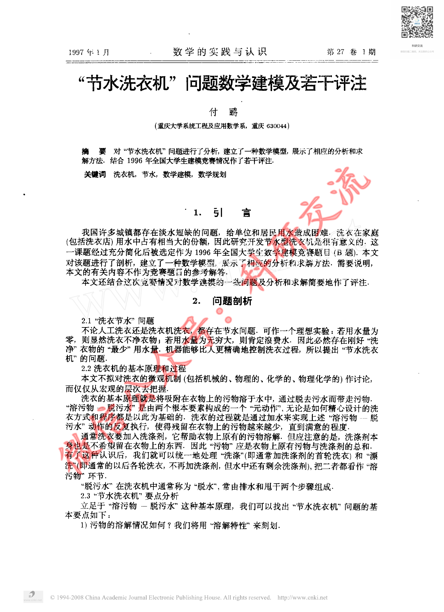
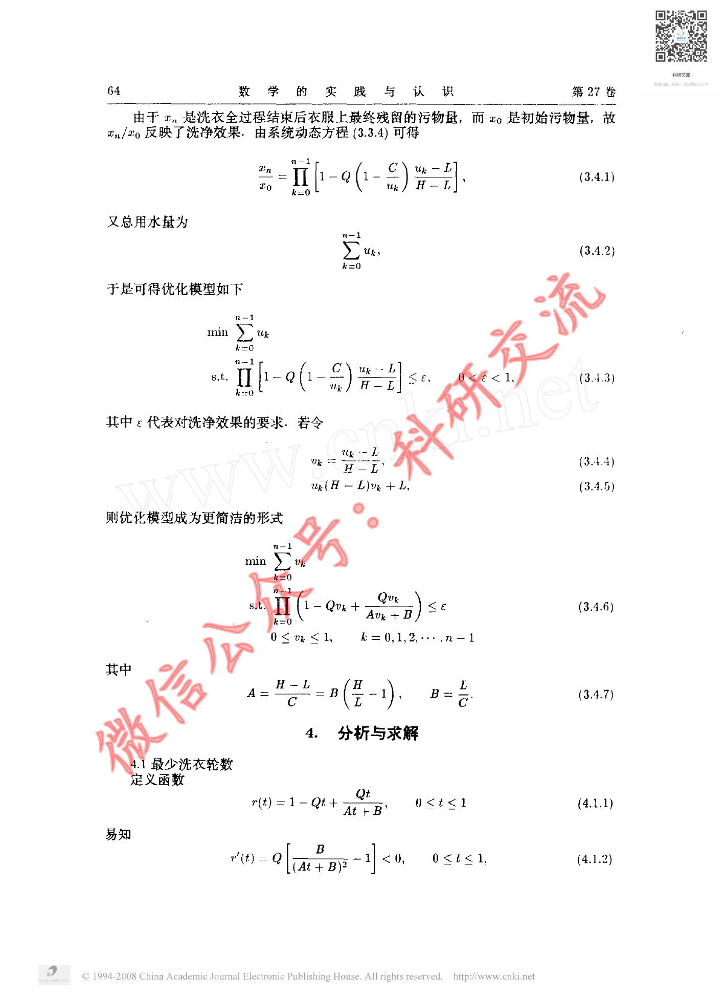
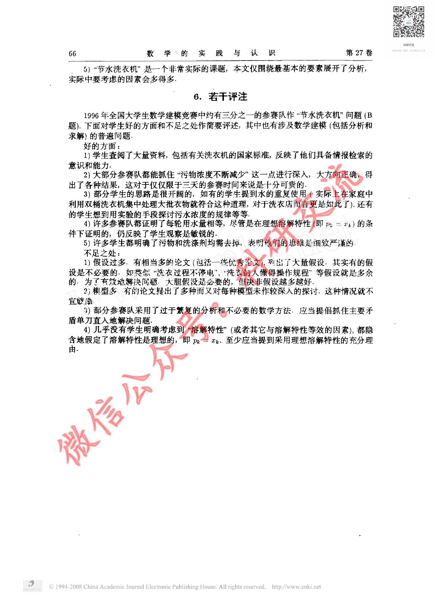

# Before / After Evidence — CUMCM-1996-B-001

This is an evidence comparison for the original G11 MAJOR finding. It is not a human decision.

## Original defective state (historical authoritative evidence)

- Original decision sheet: `catalog/scale/g11_manual_sample_decisions.csv`; sample_order `25`; severity `MAJOR`.
- Historical body SHA256 before repair: `1D9182549363CD07A8F3D657C2AD60D5197D3991577AD22ACB1BFC0A2C456E59`.
- Historical packet: `reports/scale/g11_manual_sample_review/25_CUMCM-1996-B-001`.
- Original major evidence: 源页面包含完整正文与公式，但artifact excerpt没有对应文本，仅保留source_page标记。属于实质正文缺失，而非轻微OCR错误。

### Historical review unit G11-MANUAL-SAMPLE-25-PAGE-A

- Historical source render: `reports/scale/g11_manual_sample_review/25_CUMCM-1996-B-001/page_A.png`.
- Historical formal excerpt: `reports/scale/g11_manual_sample_review/25_CUMCM-1996-B-001/page_A_artifact_excerpt.txt`.
- Historical page-content SHA from triage: `E3B0C44298FC1C149AFBF4C8996FB92427AE41E4649B934CA495991B7852B855`.

<pre>
paper_id=CUMCM-1996-B-001
page_number=1
page_classification=FIRST_PAGE_FROM_FROZEN_PAGE_COUNT
source_path=1996年数学建模国赛真题+优秀论文/1996年国赛优秀论文/1996B：节水洗衣机问题数学建模及若干评注.pdf
source_sha256=6EF9201798BF3E216638A2B044038F05712CE4507B9E00192554895DC96D4278
persisted_page_text_path=NOT_AVAILABLE_FOR_THIS_STRATUM

=== PERSISTED PAGE TEXT (READ-ONLY EXISTING EVIDENCE) ===
[No page-local persisted text is available; no new extraction was run.]

=== FORMAL ARTIFACT CONTEXT WINDOW ===
# Extracted Paper

<!-- source_page: 1 -->

<!-- source_page: 2 -->

<!-- source_page: 3 -->

<!-- source_page: 4 -->

<!-- source_page: 5 -->

=== HUMAN REVIEW NOTE ===
This file prepares evidence only. It is not a human review decision.

</pre>

### Historical review unit G11-MANUAL-SAMPLE-25-PAGE-B

- Historical source render: `reports/scale/g11_manual_sample_review/25_CUMCM-1996-B-001/page_B.png`.
- Historical formal excerpt: `reports/scale/g11_manual_sample_review/25_CUMCM-1996-B-001/page_B_artifact_excerpt.txt`.
- Historical page-content SHA from triage: `E3B0C44298FC1C149AFBF4C8996FB92427AE41E4649B934CA495991B7852B855`.

<pre>
paper_id=CUMCM-1996-B-001
page_number=3
page_classification=MIDDLE_PAGE_FROM_FROZEN_PAGE_COUNT
source_path=1996年数学建模国赛真题+优秀论文/1996年国赛优秀论文/1996B：节水洗衣机问题数学建模及若干评注.pdf
source_sha256=6EF9201798BF3E216638A2B044038F05712CE4507B9E00192554895DC96D4278
persisted_page_text_path=NOT_AVAILABLE_FOR_THIS_STRATUM

=== PERSISTED PAGE TEXT (READ-ONLY EXISTING EVIDENCE) ===
[No page-local persisted text is available; no new extraction was run.]

=== FORMAL ARTIFACT CONTEXT WINDOW ===
e: 2 -->

<!-- source_page: 3 -->

<!-- source_page: 4 -->

<!-- source_page: 5 -->

=== HUMAN REVIEW NOTE ===
This file prepares evidence only. It is not a human review decision.

</pre>

### Historical review unit G11-MANUAL-SAMPLE-25-PAGE-C

- Historical source render: `reports/scale/g11_manual_sample_review/25_CUMCM-1996-B-001/page_C.png`.
- Historical formal excerpt: `reports/scale/g11_manual_sample_review/25_CUMCM-1996-B-001/page_C_artifact_excerpt.txt`.
- Historical page-content SHA from triage: `E3B0C44298FC1C149AFBF4C8996FB92427AE41E4649B934CA495991B7852B855`.

<pre>
paper_id=CUMCM-1996-B-001
page_number=5
page_classification=LAST_PAGE_FROM_FROZEN_PAGE_COUNT
source_path=1996年数学建模国赛真题+优秀论文/1996年国赛优秀论文/1996B：节水洗衣机问题数学建模及若干评注.pdf
source_sha256=6EF9201798BF3E216638A2B044038F05712CE4507B9E00192554895DC96D4278
persisted_page_text_path=NOT_AVAILABLE_FOR_THIS_STRATUM

=== PERSISTED PAGE TEXT (READ-ONLY EXISTING EVIDENCE) ===
[No page-local persisted text is available; no new extraction was run.]

=== FORMAL ARTIFACT CONTEXT WINDOW ===
>

<!-- source_page: 5 -->

=== HUMAN REVIEW NOTE ===
This file prepares evidence only. It is not a human review decision.

</pre>

## Current repaired state (read-only current formal evidence)

### Current source page 1

- Current formal excerpt: `reports/scale/g11_post_repair_human_rereview/06_CUMCM-1996-B-001/current_formal_p1.md`.
- Current page segment SHA256: `4CD667F4EB18C3FD83C4C366011442EE9383A856A916518D099BE3171F223230`.
- Raw current excerpt SHA256: `4E7296FC0E0DF771C9BDC43C5C9B159F6332A5EDBE5B429BACFB417180919645`.
- Repair evidence: `catalog/scale/g11_residual_pdftotext_calibration/positive/CUMCM-1996-B-001/source_page_1.txt`; evidence SHA256 `59CF42EE461FA4961FC6FB06D4530812061A2E412096E63E00A4A94197A8D092`.
- Programmatic repair validation: `postrepair_pass=1`.

### Current source page 3

- Current formal excerpt: `reports/scale/g11_post_repair_human_rereview/06_CUMCM-1996-B-001/current_formal_p3.md`.
- Current page segment SHA256: `1898278FB519EC4C2E311D81B88AF47CFF374513D773C8DC00DD68A0CC590A23`.
- Raw current excerpt SHA256: `1AA4F4D1D0EE7C355FC137E76729C3189A4E780D39391D2EACA8FE7CDA5C2FFE`.
- Repair evidence: `catalog/scale/g11_residual_pdftotext_calibration/positive/CUMCM-1996-B-001/source_page_3.txt`; evidence SHA256 `EBC77A051585BE278BF03BB34D45EA109A6B742E561B6EDB24F3E10389E9EC67`.
- Programmatic repair validation: `postrepair_pass=1`.

### Current source page 5

- Current formal excerpt: `reports/scale/g11_post_repair_human_rereview/06_CUMCM-1996-B-001/current_formal_p5.md`.
- Current page segment SHA256: `E683E4D2C06FD0E0B4C53AB35755A1C44024F95244E084DDA7D7C5AF2B3DD5DB`.
- Raw current excerpt SHA256: `DC8551781B376F6DEB473C3F5ED8903663E4D7641EA33C4AC3B2E1564A6EB215`.
- Repair evidence: `catalog/scale/g11_residual_pdftotext_calibration/positive/CUMCM-1996-B-001/source_page_5.txt`; evidence SHA256 `DE61E2AA2B098C579B5A1803157DFF842328B424A66ED8EBC7654D6E60EDF472`.
- Programmatic repair validation: `postrepair_pass=1`.

The historical block is linked to the original packet evidence; the current block is extracted from the current formal `paper.md`. Human reviewers must compare the original issue with the repaired content and decide the new severity independently.

## Source Page Images

Existing historical source-render copies for the corresponding rereview units:

- `G11-MANUAL-SAMPLE-25-PAGE-A` / source page `1`: 
  - Original PNG: `reports/scale/g11_manual_sample_review/25_CUMCM-1996-B-001/page_A.png`; SHA256 `2968C6D3C18841C3145BD3CB90520D8A9FB8ECE9C9E1FF40D1042866657E56B5`.
  - Copied PNG: `source_images/source_unit_01_p1.png`; SHA256 `2968C6D3C18841C3145BD3CB90520D8A9FB8ECE9C9E1FF40D1042866657E56B5`.
- `G11-MANUAL-SAMPLE-25-PAGE-B` / source page `3`: 
  - Original PNG: `reports/scale/g11_manual_sample_review/25_CUMCM-1996-B-001/page_B.png`; SHA256 `0356314AA2E2DEDBA1ECA72F3D2548925265B268EE2B807BE730E04BF7469B43`.
  - Copied PNG: `source_images/source_unit_02_p3.png`; SHA256 `0356314AA2E2DEDBA1ECA72F3D2548925265B268EE2B807BE730E04BF7469B43`.
- `G11-MANUAL-SAMPLE-25-PAGE-C` / source page `5`: 
  - Original PNG: `reports/scale/g11_manual_sample_review/25_CUMCM-1996-B-001/page_C.png`; SHA256 `096CCBD50EB8D92D590BFFCD305A945778DEB46497C71AC2427D161639D55DA9`.
  - Copied PNG: `source_images/source_unit_03_p5.png`; SHA256 `096CCBD50EB8D92D590BFFCD305A945778DEB46497C71AC2427D161639D55DA9`.
