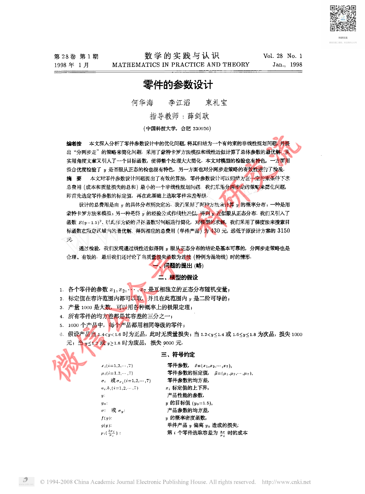
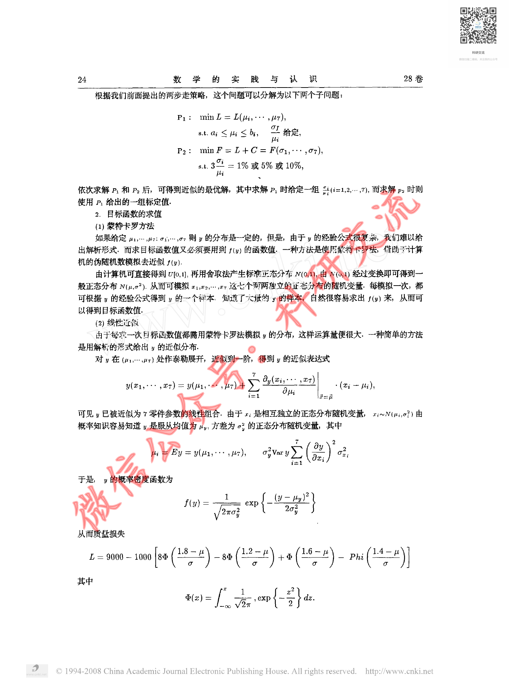
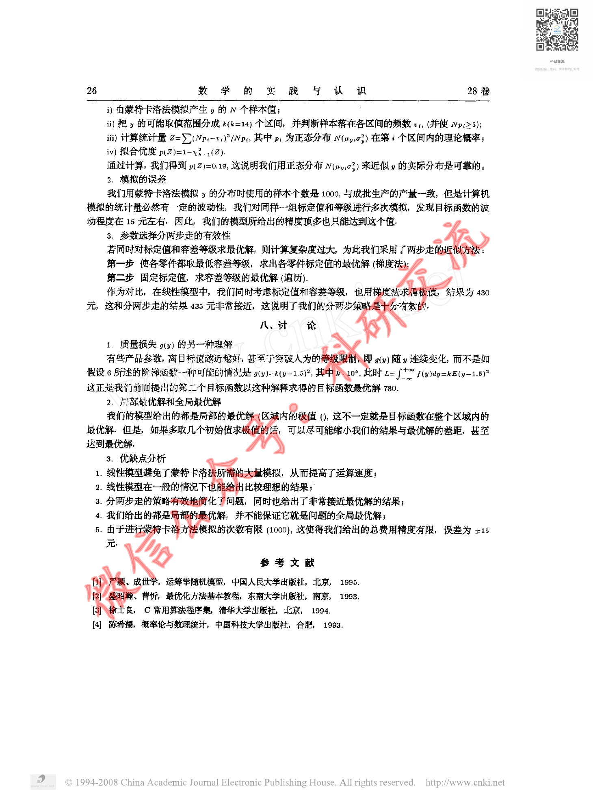

# Before / After Evidence — CUMCM-1997-A-008

This is an evidence comparison for the original G11 MAJOR finding. It is not a human decision.

## Original defective state (historical authoritative evidence)

- Original decision sheet: `catalog/scale/g11_manual_sample_decisions.csv`; sample_order `26`; severity `MAJOR`.
- Historical body SHA256 before repair: `1D9182549363CD07A8F3D657C2AD60D5197D3991577AD22ACB1BFC0A2C456E59`.
- Historical packet: `reports/scale/g11_manual_sample_review/26_CUMCM-1997-A-008`.
- Original major evidence: 源页面包含正文和数学公式，artifact excerpt基本为空，仅有source_page标记；抽样内容无法在formal artifact中找到对应文本。

### Historical review unit G11-MANUAL-SAMPLE-26-PAGE-A

- Historical source render: `reports/scale/g11_manual_sample_review/26_CUMCM-1997-A-008/page_A.png`.
- Historical formal excerpt: `reports/scale/g11_manual_sample_review/26_CUMCM-1997-A-008/page_A_artifact_excerpt.txt`.
- Historical page-content SHA from triage: `E3B0C44298FC1C149AFBF4C8996FB92427AE41E4649B934CA495991B7852B855`.

<pre>
paper_id=CUMCM-1997-A-008
page_number=1
page_classification=FIRST_PAGE_FROM_FROZEN_PAGE_COUNT
source_path=1997年数学建模国赛真题+优秀论文/1997年国赛优秀论文/1997A：零件的参数设计(1).pdf
source_sha256=7CE89B136265005FB597C7886D441E66504DB71F07101F0F67BC3B94C4543948
persisted_page_text_path=NOT_AVAILABLE_FOR_THIS_STRATUM

=== PERSISTED PAGE TEXT (READ-ONLY EXISTING EVIDENCE) ===
[No page-local persisted text is available; no new extraction was run.]

=== FORMAL ARTIFACT CONTEXT WINDOW ===
# Extracted Paper

<!-- source_page: 1 -->

<!-- source_page: 2 -->

<!-- source_page: 3 -->

<!-- source_page: 4 -->

<!-- source_page: 5 -->

=== HUMAN REVIEW NOTE ===
This file prepares evidence only. It is not a human review decision.

</pre>

### Historical review unit G11-MANUAL-SAMPLE-26-PAGE-B

- Historical source render: `reports/scale/g11_manual_sample_review/26_CUMCM-1997-A-008/page_B.png`.
- Historical formal excerpt: `reports/scale/g11_manual_sample_review/26_CUMCM-1997-A-008/page_B_artifact_excerpt.txt`.
- Historical page-content SHA from triage: `E3B0C44298FC1C149AFBF4C8996FB92427AE41E4649B934CA495991B7852B855`.

<pre>
paper_id=CUMCM-1997-A-008
page_number=3
page_classification=MIDDLE_PAGE_FROM_FROZEN_PAGE_COUNT
source_path=1997年数学建模国赛真题+优秀论文/1997年国赛优秀论文/1997A：零件的参数设计(1).pdf
source_sha256=7CE89B136265005FB597C7886D441E66504DB71F07101F0F67BC3B94C4543948
persisted_page_text_path=NOT_AVAILABLE_FOR_THIS_STRATUM

=== PERSISTED PAGE TEXT (READ-ONLY EXISTING EVIDENCE) ===
[No page-local persisted text is available; no new extraction was run.]

=== FORMAL ARTIFACT CONTEXT WINDOW ===
e: 2 -->

<!-- source_page: 3 -->

<!-- source_page: 4 -->

<!-- source_page: 5 -->

=== HUMAN REVIEW NOTE ===
This file prepares evidence only. It is not a human review decision.

</pre>

### Historical review unit G11-MANUAL-SAMPLE-26-PAGE-C

- Historical source render: `reports/scale/g11_manual_sample_review/26_CUMCM-1997-A-008/page_C.png`.
- Historical formal excerpt: `reports/scale/g11_manual_sample_review/26_CUMCM-1997-A-008/page_C_artifact_excerpt.txt`.
- Historical page-content SHA from triage: `E3B0C44298FC1C149AFBF4C8996FB92427AE41E4649B934CA495991B7852B855`.

<pre>
paper_id=CUMCM-1997-A-008
page_number=5
page_classification=LAST_PAGE_FROM_FROZEN_PAGE_COUNT
source_path=1997年数学建模国赛真题+优秀论文/1997年国赛优秀论文/1997A：零件的参数设计(1).pdf
source_sha256=7CE89B136265005FB597C7886D441E66504DB71F07101F0F67BC3B94C4543948
persisted_page_text_path=NOT_AVAILABLE_FOR_THIS_STRATUM

=== PERSISTED PAGE TEXT (READ-ONLY EXISTING EVIDENCE) ===
[No page-local persisted text is available; no new extraction was run.]

=== FORMAL ARTIFACT CONTEXT WINDOW ===
>

<!-- source_page: 5 -->

=== HUMAN REVIEW NOTE ===
This file prepares evidence only. It is not a human review decision.

</pre>

## Current repaired state (read-only current formal evidence)

### Current source page 1

- Current formal excerpt: `reports/scale/g11_post_repair_human_rereview/07_CUMCM-1997-A-008/current_formal_p1.md`.
- Current page segment SHA256: `7D3881450123FD48514805B8375FF13A87E7D9FEE0CA7F19D9E37E44AF0E0638`.
- Raw current excerpt SHA256: `59227207920FC7D38B6AD40B7AE08F06F5FB56D9903BAE1F65CEA3DC9370D6E4`.
- Repair evidence: `catalog/scale/g11_residual_pdftotext_calibration/positive/CUMCM-1997-A-008/source_page_1.txt`; evidence SHA256 `118D7BCBF5CFF454BC9A3F384F37754B24F64F22BE0217415C1DB0A51423D39F`.
- Programmatic repair validation: `postrepair_pass=1`.

### Current source page 3

- Current formal excerpt: `reports/scale/g11_post_repair_human_rereview/07_CUMCM-1997-A-008/current_formal_p3.md`.
- Current page segment SHA256: `5FB0AC4F2F16D0F8201E3786E72F5E113E290D17A9326A24263D722AA73418A4`.
- Raw current excerpt SHA256: `933195C3F8CDE619C24DE462F5DB24B156058A93F773E92EF3D941F426381883`.
- Repair evidence: `catalog/scale/g11_residual_pdftotext_calibration/positive/CUMCM-1997-A-008/source_page_3.txt`; evidence SHA256 `A61B8BF6F6B1241C9B9A14864882BBC71870855161DC9320F456CE65843DAD8E`.
- Programmatic repair validation: `postrepair_pass=1`.

### Current source page 5

- Current formal excerpt: `reports/scale/g11_post_repair_human_rereview/07_CUMCM-1997-A-008/current_formal_p5.md`.
- Current page segment SHA256: `8764CD4B090805ABCCEDB9F4D1D9A1F1CB5ABD21A2E74B6A35CD52EDD3BF75A3`.
- Raw current excerpt SHA256: `5740ACA89466720B45064D91C55749CAE2AE3C05D918C49E1A59EDD3E318D832`.
- Repair evidence: `catalog/scale/g11_residual_pdftotext_calibration/positive/CUMCM-1997-A-008/source_page_5.txt`; evidence SHA256 `2BA2C0A097258B34487AD62E09243E2EF78C49924C5C2DFDE62723344857A3A9`.
- Programmatic repair validation: `postrepair_pass=1`.

The historical block is linked to the original packet evidence; the current block is extracted from the current formal `paper.md`. Human reviewers must compare the original issue with the repaired content and decide the new severity independently.

## Source Page Images

Existing historical source-render copies for the corresponding rereview units:

- `G11-MANUAL-SAMPLE-26-PAGE-A` / source page `1`: 
  - Original PNG: `reports/scale/g11_manual_sample_review/26_CUMCM-1997-A-008/page_A.png`; SHA256 `5DE3E52663A3E481D2DC58C15051CA23A308D56C6A3E71E617F06C826E1E9364`.
  - Copied PNG: `source_images/source_unit_01_p1.png`; SHA256 `5DE3E52663A3E481D2DC58C15051CA23A308D56C6A3E71E617F06C826E1E9364`.
- `G11-MANUAL-SAMPLE-26-PAGE-B` / source page `3`: 
  - Original PNG: `reports/scale/g11_manual_sample_review/26_CUMCM-1997-A-008/page_B.png`; SHA256 `495418B72BEF7A88F0704200C32A2446308AA82974BA9215B23C7EA2089FC7D8`.
  - Copied PNG: `source_images/source_unit_02_p3.png`; SHA256 `495418B72BEF7A88F0704200C32A2446308AA82974BA9215B23C7EA2089FC7D8`.
- `G11-MANUAL-SAMPLE-26-PAGE-C` / source page `5`: 
  - Original PNG: `reports/scale/g11_manual_sample_review/26_CUMCM-1997-A-008/page_C.png`; SHA256 `5C322A97E7961320AD6E99EEFC38A86F63C9C4B388B9C528AB1F14B2735EB6EB`.
  - Copied PNG: `source_images/source_unit_03_p5.png`; SHA256 `5C322A97E7961320AD6E99EEFC38A86F63C9C4B388B9C528AB1F14B2735EB6EB`.
