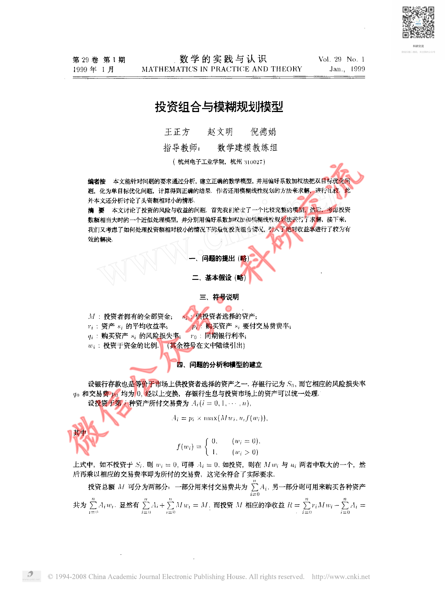
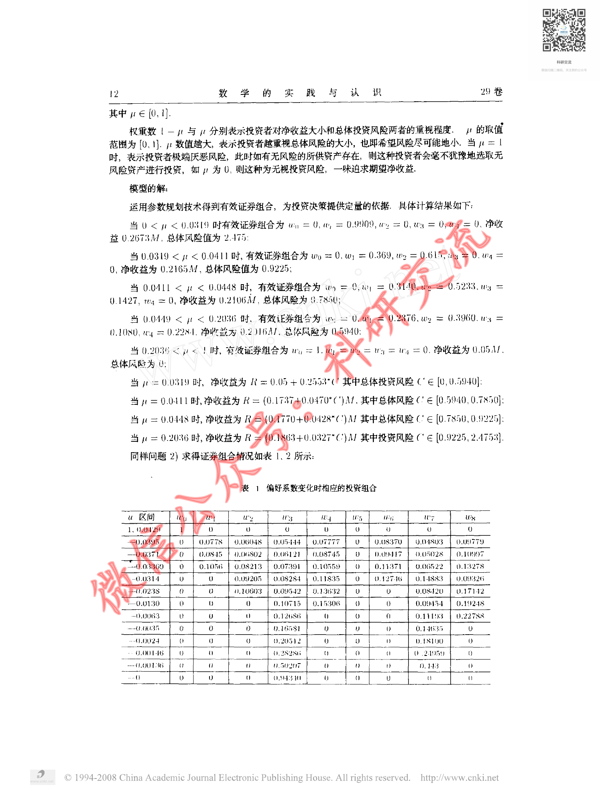
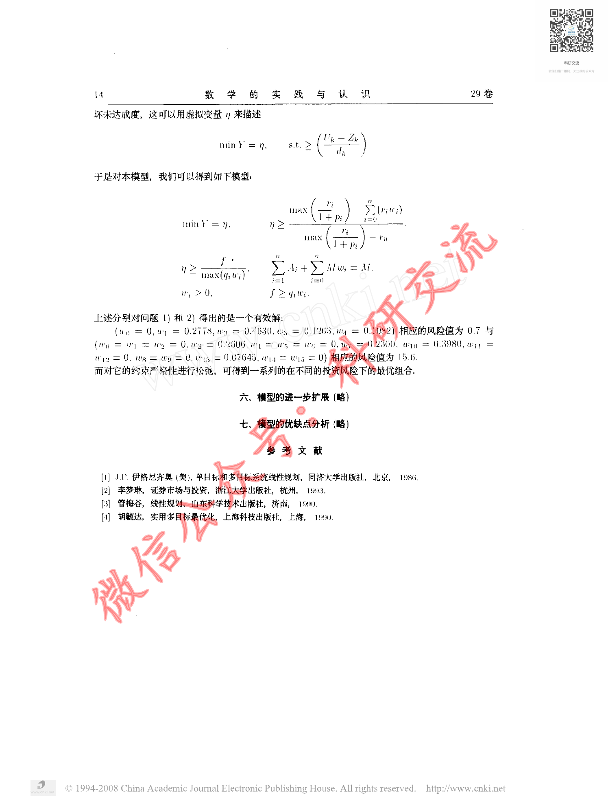

# Before / After Evidence — CUMCM-1998-A-007

This is an evidence comparison for the original G11 MAJOR finding. It is not a human decision.

## Original defective state (historical authoritative evidence)

- Original decision sheet: `catalog/scale/g11_manual_sample_decisions.csv`; sample_order `27`; severity `MAJOR`.
- Historical body SHA256 before repair: `1D9182549363CD07A8F3D657C2AD60D5197D3991577AD22ACB1BFC0A2C456E59`.
- Historical packet: `reports/scale/g11_manual_sample_review/27_CUMCM-1998-A-007`.
- Original major evidence: 源页面可见正文、公式及数据表，而artifact excerpt只有页标记、没有实质文本，存在明显正文/表格内容缺失。

### Historical review unit G11-MANUAL-SAMPLE-27-PAGE-A

- Historical source render: `reports/scale/g11_manual_sample_review/27_CUMCM-1998-A-007/page_A.png`.
- Historical formal excerpt: `reports/scale/g11_manual_sample_review/27_CUMCM-1998-A-007/page_A_artifact_excerpt.txt`.
- Historical page-content SHA from triage: `E3B0C44298FC1C149AFBF4C8996FB92427AE41E4649B934CA495991B7852B855`.

<pre>
paper_id=CUMCM-1998-A-007
page_number=1
page_classification=FIRST_PAGE_FROM_FROZEN_PAGE_COUNT
source_path=1998年数学建模国赛真题+优秀论文/1998年国赛优秀论文/1998A：投资组合与模糊规划模型.pdf
source_sha256=9916DF219AE450DE559416FC928BC4DF0EE7FCB63B13887739C487F561D04B30
persisted_page_text_path=NOT_AVAILABLE_FOR_THIS_STRATUM

=== PERSISTED PAGE TEXT (READ-ONLY EXISTING EVIDENCE) ===
[No page-local persisted text is available; no new extraction was run.]

=== FORMAL ARTIFACT CONTEXT WINDOW ===
# Extracted Paper

<!-- source_page: 1 -->

<!-- source_page: 2 -->

<!-- source_page: 3 -->

<!-- source_page: 4 -->

<!-- source_page: 5 -->

=== HUMAN REVIEW NOTE ===
This file prepares evidence only. It is not a human review decision.

</pre>

### Historical review unit G11-MANUAL-SAMPLE-27-PAGE-B

- Historical source render: `reports/scale/g11_manual_sample_review/27_CUMCM-1998-A-007/page_B.png`.
- Historical formal excerpt: `reports/scale/g11_manual_sample_review/27_CUMCM-1998-A-007/page_B_artifact_excerpt.txt`.
- Historical page-content SHA from triage: `E3B0C44298FC1C149AFBF4C8996FB92427AE41E4649B934CA495991B7852B855`.

<pre>
paper_id=CUMCM-1998-A-007
page_number=3
page_classification=MIDDLE_PAGE_FROM_FROZEN_PAGE_COUNT
source_path=1998年数学建模国赛真题+优秀论文/1998年国赛优秀论文/1998A：投资组合与模糊规划模型.pdf
source_sha256=9916DF219AE450DE559416FC928BC4DF0EE7FCB63B13887739C487F561D04B30
persisted_page_text_path=NOT_AVAILABLE_FOR_THIS_STRATUM

=== PERSISTED PAGE TEXT (READ-ONLY EXISTING EVIDENCE) ===
[No page-local persisted text is available; no new extraction was run.]

=== FORMAL ARTIFACT CONTEXT WINDOW ===
e: 2 -->

<!-- source_page: 3 -->

<!-- source_page: 4 -->

<!-- source_page: 5 -->

=== HUMAN REVIEW NOTE ===
This file prepares evidence only. It is not a human review decision.

</pre>

### Historical review unit G11-MANUAL-SAMPLE-27-PAGE-C

- Historical source render: `reports/scale/g11_manual_sample_review/27_CUMCM-1998-A-007/page_C.png`.
- Historical formal excerpt: `reports/scale/g11_manual_sample_review/27_CUMCM-1998-A-007/page_C_artifact_excerpt.txt`.
- Historical page-content SHA from triage: `E3B0C44298FC1C149AFBF4C8996FB92427AE41E4649B934CA495991B7852B855`.

<pre>
paper_id=CUMCM-1998-A-007
page_number=5
page_classification=LAST_PAGE_FROM_FROZEN_PAGE_COUNT
source_path=1998年数学建模国赛真题+优秀论文/1998年国赛优秀论文/1998A：投资组合与模糊规划模型.pdf
source_sha256=9916DF219AE450DE559416FC928BC4DF0EE7FCB63B13887739C487F561D04B30
persisted_page_text_path=NOT_AVAILABLE_FOR_THIS_STRATUM

=== PERSISTED PAGE TEXT (READ-ONLY EXISTING EVIDENCE) ===
[No page-local persisted text is available; no new extraction was run.]

=== FORMAL ARTIFACT CONTEXT WINDOW ===
>

<!-- source_page: 5 -->

=== HUMAN REVIEW NOTE ===
This file prepares evidence only. It is not a human review decision.

</pre>

## Current repaired state (read-only current formal evidence)

### Current source page 1

- Current formal excerpt: `reports/scale/g11_post_repair_human_rereview/08_CUMCM-1998-A-007/current_formal_p1.md`.
- Current page segment SHA256: `4B19983960725F4D6D8C715C9A8BCB7B57CAA1B5BBECE11B22640E1441DF692F`.
- Raw current excerpt SHA256: `47699971AD47280E91C9780EBCE83AD822FDD8BA23518069EA61094BC00EFE93`.
- Repair evidence: `catalog/scale/g11_residual_pdftotext_calibration/positive/CUMCM-1998-A-007/source_page_1.txt`; evidence SHA256 `249287DA407FB54A58993E32C036BD776D0F892780A47A2FA04123CF6F474260`.
- Programmatic repair validation: `postrepair_pass=1`.

### Current source page 3

- Current formal excerpt: `reports/scale/g11_post_repair_human_rereview/08_CUMCM-1998-A-007/current_formal_p3.md`.
- Current page segment SHA256: `DD29C4E52F4509C8C4AD2219F33CFA94DA2646B9D4EFD01203042AF78EB0C205`.
- Raw current excerpt SHA256: `BBD2A7115A94BD235A6E8BA21D4D98A06E19CCD83E5311BBF86CD875C471CDC0`.
- Repair evidence: `catalog/scale/g11_residual_pdftotext_calibration/positive/CUMCM-1998-A-007/source_page_3.txt`; evidence SHA256 `9CC3C5AF9991A69DA85B45DE938701665CEEE5FA5580AC81D166957C64FA6DC4`.
- Programmatic repair validation: `postrepair_pass=1`.

### Current source page 5

- Current formal excerpt: `reports/scale/g11_post_repair_human_rereview/08_CUMCM-1998-A-007/current_formal_p5.md`.
- Current page segment SHA256: `90A341F9A5DEE960591DEBD164D85E6108CD454CB2A3EF59B3B536574CD91092`.
- Raw current excerpt SHA256: `0FA2C3CE1B5715D85A49C8AD6310EF91CB4D88C521A9E43962CB70C76C9AF298`.
- Repair evidence: `catalog/scale/g11_residual_pdftotext_calibration/positive/CUMCM-1998-A-007/source_page_5.txt`; evidence SHA256 `5342A67DA416B8C183F0F8A78F7D4A09BF106492644AAB61C987648BD22B2EBA`.
- Programmatic repair validation: `postrepair_pass=1`.

The historical block is linked to the original packet evidence; the current block is extracted from the current formal `paper.md`. Human reviewers must compare the original issue with the repaired content and decide the new severity independently.

## Source Page Images

Existing historical source-render copies for the corresponding rereview units:

- `G11-MANUAL-SAMPLE-27-PAGE-A` / source page `1`: 
  - Original PNG: `reports/scale/g11_manual_sample_review/27_CUMCM-1998-A-007/page_A.png`; SHA256 `FDD98168D4041CEC45C28A1E8DF12F20A514B5125E50721E84D68647F1D10E52`.
  - Copied PNG: `source_images/source_unit_01_p1.png`; SHA256 `FDD98168D4041CEC45C28A1E8DF12F20A514B5125E50721E84D68647F1D10E52`.
- `G11-MANUAL-SAMPLE-27-PAGE-B` / source page `3`: 
  - Original PNG: `reports/scale/g11_manual_sample_review/27_CUMCM-1998-A-007/page_B.png`; SHA256 `E8737512ACF6FC22552036EA279E0DA3AC36711731FB13F3B35E7263900906DE`.
  - Copied PNG: `source_images/source_unit_02_p3.png`; SHA256 `E8737512ACF6FC22552036EA279E0DA3AC36711731FB13F3B35E7263900906DE`.
- `G11-MANUAL-SAMPLE-27-PAGE-C` / source page `5`: 
  - Original PNG: `reports/scale/g11_manual_sample_review/27_CUMCM-1998-A-007/page_C.png`; SHA256 `E8524EFE7B2A150C55C7508183931EA4DF6CB9349C50A2CCFE322C2E15D8D25D`.
  - Copied PNG: `source_images/source_unit_03_p5.png`; SHA256 `E8524EFE7B2A150C55C7508183931EA4DF6CB9349C50A2CCFE322C2E15D8D25D`.
