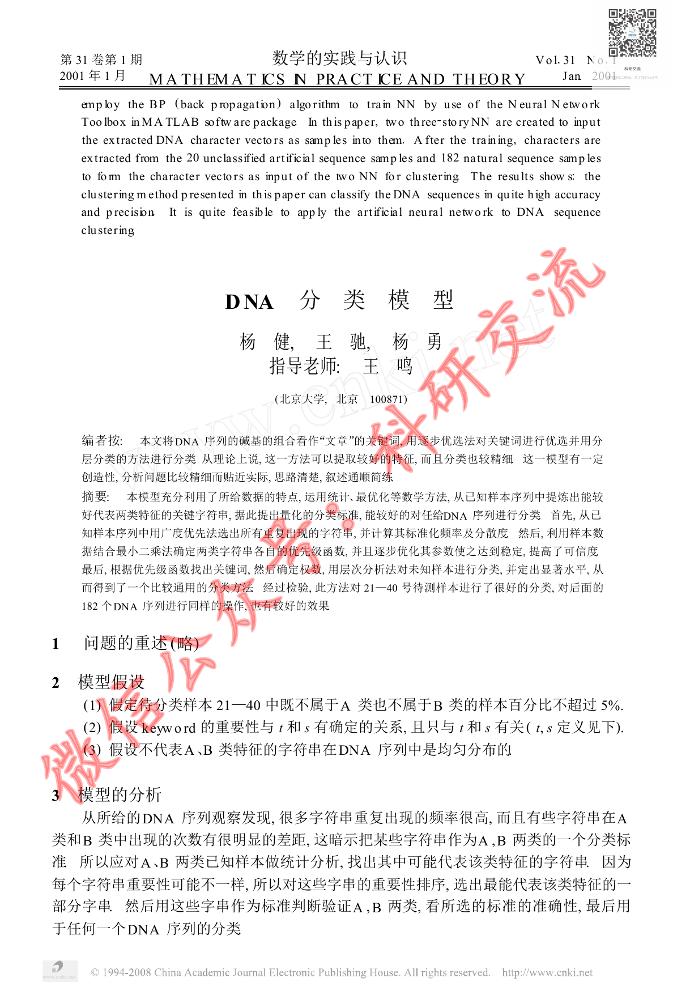
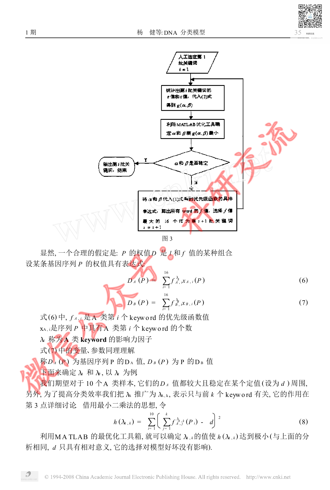
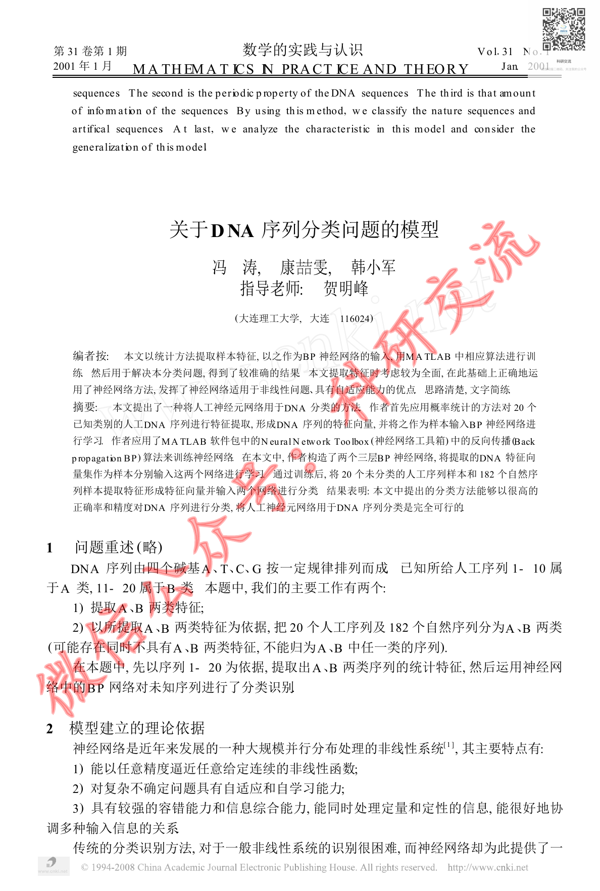

# Before / After Evidence — CUMCM-2000-A-005

This is an evidence comparison for the original G11 MAJOR finding. It is not a human decision.

## Original defective state (historical authoritative evidence)

- Original decision sheet: `catalog/scale/g11_manual_sample_decisions.csv`; sample_order `28`; severity `MAJOR`.
- Historical body SHA256 before repair: `1C2FC324063A906FF208763D2826E0A769B059290333B0542241C22CD9C91DE8`.
- Historical packet: `reports/scale/g11_manual_sample_review/28_CUMCM-2000-A-005`.
- Original major evidence: DNA分类论文源页面包含正文、流程图和公式，但artifact excerpt仅有source_page标记，没有对应正文，属于明显内容缺失。

### Historical review unit G11-MANUAL-SAMPLE-28-PAGE-A

- Historical source render: `reports/scale/g11_manual_sample_review/28_CUMCM-2000-A-005/page_A.png`.
- Historical formal excerpt: `reports/scale/g11_manual_sample_review/28_CUMCM-2000-A-005/page_A_artifact_excerpt.txt`.
- Historical page-content SHA from triage: `E3B0C44298FC1C149AFBF4C8996FB92427AE41E4649B934CA495991B7852B855`.

<pre>
paper_id=CUMCM-2000-A-005
page_number=1
page_classification=FIRST_PAGE_FROM_FROZEN_PAGE_COUNT
source_path=2000年数学建模国赛真题+优秀论文/2000年国赛优秀论文/2000A：DNA分类模型.pdf
source_sha256=FB22E1231902AA036AE4EA61EA9948CA636F2B780A29A5AD487B092251B25EA0
persisted_page_text_path=NOT_AVAILABLE_FOR_THIS_STRATUM

=== PERSISTED PAGE TEXT (READ-ONLY EXISTING EVIDENCE) ===
[No page-local persisted text is available; no new extraction was run.]

=== FORMAL ARTIFACT CONTEXT WINDOW ===
# Extracted Paper

<!-- source_page: 1 -->

<!-- source_page: 2 -->

<!-- source_page: 3 -->

<!-- source_page: 4 -->

<!-- source_page: 5 -->

<!-- source_page: 6 -->

<!-- source_page: 7 -->

<!-- source_page: 8 -->

<!-- source_page: 9 -->

=== HUMAN REVIEW NOTE ===
This file prepares evidence only. It is not a human review decision.

</pre>

### Historical review unit G11-MANUAL-SAMPLE-28-PAGE-B

- Historical source render: `reports/scale/g11_manual_sample_review/28_CUMCM-2000-A-005/page_B.png`.
- Historical formal excerpt: `reports/scale/g11_manual_sample_review/28_CUMCM-2000-A-005/page_B_artifact_excerpt.txt`.
- Historical page-content SHA from triage: `E3B0C44298FC1C149AFBF4C8996FB92427AE41E4649B934CA495991B7852B855`.

<pre>
paper_id=CUMCM-2000-A-005
page_number=5
page_classification=MIDDLE_PAGE_FROM_FROZEN_PAGE_COUNT
source_path=2000年数学建模国赛真题+优秀论文/2000年国赛优秀论文/2000A：DNA分类模型.pdf
source_sha256=FB22E1231902AA036AE4EA61EA9948CA636F2B780A29A5AD487B092251B25EA0
persisted_page_text_path=NOT_AVAILABLE_FOR_THIS_STRATUM

=== PERSISTED PAGE TEXT (READ-ONLY EXISTING EVIDENCE) ===
[No page-local persisted text is available; no new extraction was run.]

=== FORMAL ARTIFACT CONTEXT WINDOW ===
: 4 -->

<!-- source_page: 5 -->

<!-- source_page: 6 -->

<!-- source_page: 7 -->

<!-- source_page: 8 -->

<!-- source_page: 9 -->

=== HUMAN REVIEW NOTE ===
This file prepares evidence only. It is not a human review decision.

</pre>

### Historical review unit G11-MANUAL-SAMPLE-28-PAGE-C

- Historical source render: `reports/scale/g11_manual_sample_review/28_CUMCM-2000-A-005/page_C.png`.
- Historical formal excerpt: `reports/scale/g11_manual_sample_review/28_CUMCM-2000-A-005/page_C_artifact_excerpt.txt`.
- Historical page-content SHA from triage: `E3B0C44298FC1C149AFBF4C8996FB92427AE41E4649B934CA495991B7852B855`.

<pre>
paper_id=CUMCM-2000-A-005
page_number=9
page_classification=LAST_PAGE_FROM_FROZEN_PAGE_COUNT
source_path=2000年数学建模国赛真题+优秀论文/2000年国赛优秀论文/2000A：DNA分类模型.pdf
source_sha256=FB22E1231902AA036AE4EA61EA9948CA636F2B780A29A5AD487B092251B25EA0
persisted_page_text_path=NOT_AVAILABLE_FOR_THIS_STRATUM

=== PERSISTED PAGE TEXT (READ-ONLY EXISTING EVIDENCE) ===
[No page-local persisted text is available; no new extraction was run.]

=== FORMAL ARTIFACT CONTEXT WINDOW ===

<!-- source_page: 9 -->

=== HUMAN REVIEW NOTE ===
This file prepares evidence only. It is not a human review decision.

</pre>

## Current repaired state (read-only current formal evidence)

### Current source page 1

- Current formal excerpt: `reports/scale/g11_post_repair_human_rereview/09_CUMCM-2000-A-005/current_formal_p1.md`.
- Current page segment SHA256: `CB5B10C0BFBD02B71EE81606E23106D1DF64A1948C72702CA5CBDE96AF2CDB3A`.
- Raw current excerpt SHA256: `A6DC6E68E8939B71502403952D692F567D3C30BC57B3CBC100936F5AE6EB5247`.
- Repair evidence: `catalog/scale/g11_residual_pdftotext_calibration/positive/CUMCM-2000-A-005/source_page_1.txt`; evidence SHA256 `F5C3AF4906CB9BDEFE7D0F9AF5951857B7F27BCFA526D63B513C87E24F5098A8`.
- Programmatic repair validation: `postrepair_pass=1`.

### Current source page 5

- Current formal excerpt: `reports/scale/g11_post_repair_human_rereview/09_CUMCM-2000-A-005/current_formal_p5.md`.
- Current page segment SHA256: `7D8F862BB9FD79D0B07049BC34D0FB235FCB6C18037AD9DAE694D9E3EE7DB4F4`.
- Raw current excerpt SHA256: `4CEBE1FD9472586F21A3CFEAB22D30C3AD2A597EE515DD84530510B63451C79E`.
- Repair evidence: `catalog/scale/g11_residual_pdftotext_calibration/positive/CUMCM-2000-A-005/source_page_5.txt`; evidence SHA256 `DD6097D71B2FC22478119F89B40FBA0CA059A33216F7C2FBF2BA9D3203A0A5B9`.
- Programmatic repair validation: `postrepair_pass=1`.

### Current source page 9

- Current formal excerpt: `reports/scale/g11_post_repair_human_rereview/09_CUMCM-2000-A-005/current_formal_p9.md`.
- Current page segment SHA256: `64A6B4C3CD6C51F37C8FDCBA2E675B52700D03B558C7D69CF22D959D18C68E76`.
- Raw current excerpt SHA256: `6584ECEB6D4164A64B4B8A8CC3CFF7516F6411EA0C25389F559DDE20A075F867`.
- Repair evidence: `catalog/scale/g11_residual_pdftotext_calibration/positive/CUMCM-2000-A-005/source_page_9.txt`; evidence SHA256 `9524D14573546BDECAFB0CAE278F07AAC25A87DD192A817301F264608EE160E2`.
- Programmatic repair validation: `postrepair_pass=1`.

The historical block is linked to the original packet evidence; the current block is extracted from the current formal `paper.md`. Human reviewers must compare the original issue with the repaired content and decide the new severity independently.

## Source Page Images

Existing historical source-render copies for the corresponding rereview units:

- `G11-MANUAL-SAMPLE-28-PAGE-A` / source page `1`: 
  - Original PNG: `reports/scale/g11_manual_sample_review/28_CUMCM-2000-A-005/page_A.png`; SHA256 `BD98D774FD9BDCB3A09EB517F9DDD90961830340E0A494081ED6BC0479FBD3DB`.
  - Copied PNG: `source_images/source_unit_01_p1.png`; SHA256 `BD98D774FD9BDCB3A09EB517F9DDD90961830340E0A494081ED6BC0479FBD3DB`.
- `G11-MANUAL-SAMPLE-28-PAGE-B` / source page `5`: 
  - Original PNG: `reports/scale/g11_manual_sample_review/28_CUMCM-2000-A-005/page_B.png`; SHA256 `6FA8E1EF7ED63FEFA86AF2B54BE681E92E88164E49DE72C4D9A796EB9E1262EA`.
  - Copied PNG: `source_images/source_unit_02_p5.png`; SHA256 `6FA8E1EF7ED63FEFA86AF2B54BE681E92E88164E49DE72C4D9A796EB9E1262EA`.
- `G11-MANUAL-SAMPLE-28-PAGE-C` / source page `9`: 
  - Original PNG: `reports/scale/g11_manual_sample_review/28_CUMCM-2000-A-005/page_C.png`; SHA256 `3E17E4A553886F207ADE98726F9857B31E075F34387228AB97E8757D89FE1A9F`.
  - Copied PNG: `source_images/source_unit_03_p9.png`; SHA256 `3E17E4A553886F207ADE98726F9857B31E075F34387228AB97E8757D89FE1A9F`.
