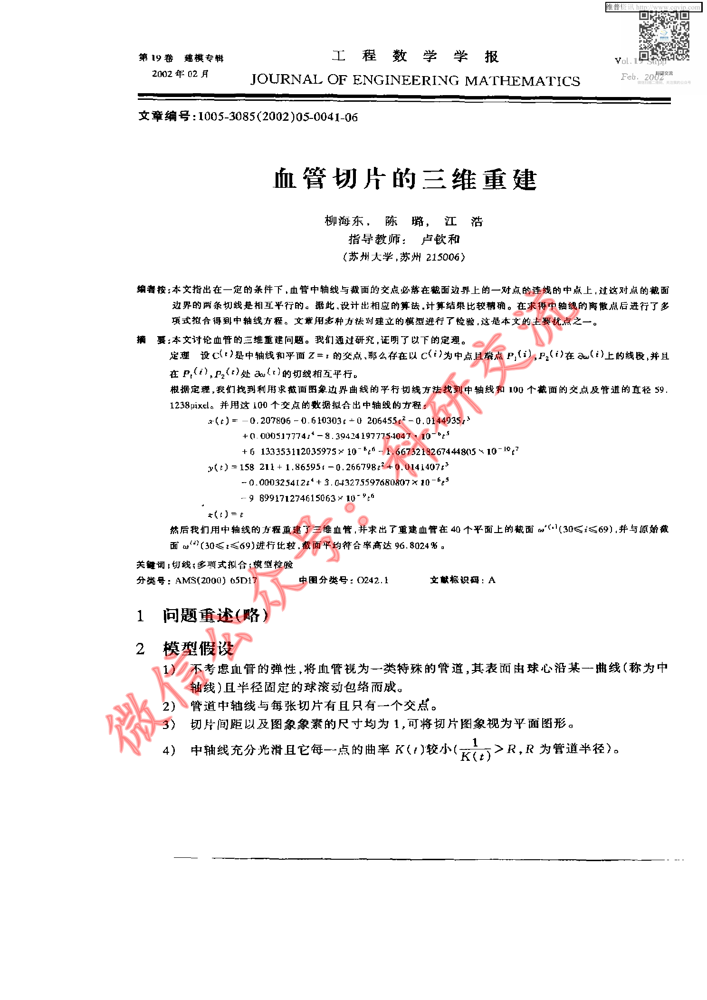
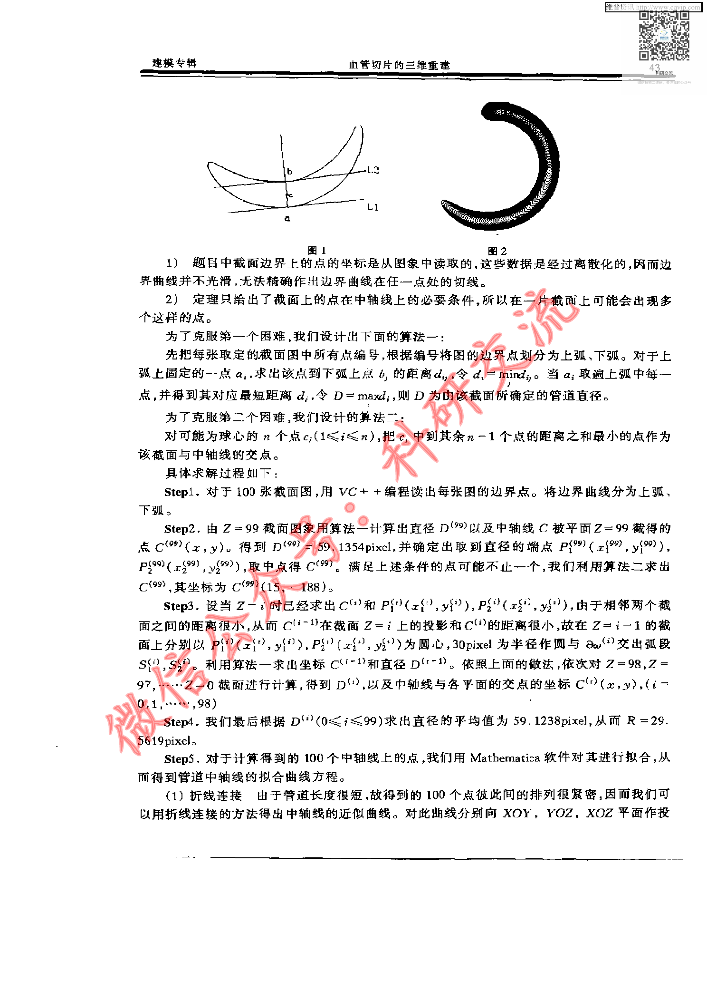
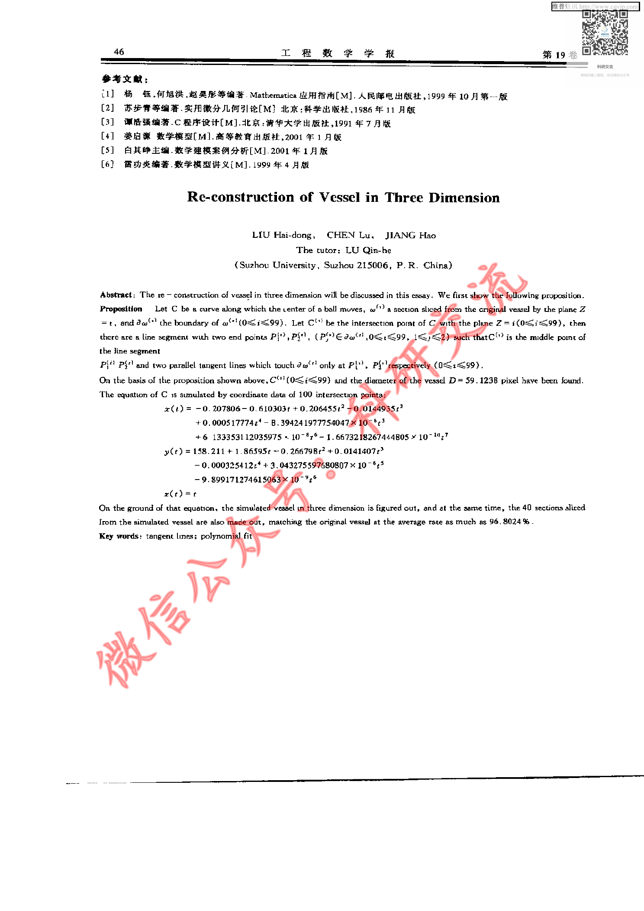

# Before / After Evidence — CUMCM-2001-A-001

This is an evidence comparison for the original G11 MAJOR finding. It is not a human decision.

## Original defective state (historical authoritative evidence)

- Original decision sheet: `catalog/scale/g11_manual_sample_decisions.csv`; sample_order `29`; severity `MAJOR`.
- Historical body SHA256 before repair: `3556B4100929F4D56319AA760B104EE0CA947F3D5B03F13F7A0DF601179225BE`.
- Historical packet: `reports/scale/g11_manual_sample_review/29_CUMCM-2001-A-001`.
- Original major evidence: 源页面包含正文、图形及英文尾页内容，但artifact excerpt没有实际论文文本，仅有页标记，按G11标准属于material missing section。

### Historical review unit G11-MANUAL-SAMPLE-29-PAGE-A

- Historical source render: `reports/scale/g11_manual_sample_review/29_CUMCM-2001-A-001/page_A.png`.
- Historical formal excerpt: `reports/scale/g11_manual_sample_review/29_CUMCM-2001-A-001/page_A_artifact_excerpt.txt`.
- Historical page-content SHA from triage: `E3B0C44298FC1C149AFBF4C8996FB92427AE41E4649B934CA495991B7852B855`.

<pre>
paper_id=CUMCM-2001-A-001
page_number=1
page_classification=FIRST_PAGE_FROM_FROZEN_PAGE_COUNT
source_path=2001年数学建模国赛真题+优秀论文/2001年国赛优秀论文/2001A：血管切片的三维重建.pdf
source_sha256=1B2A5BE4A875E37494661432EA4FB9B0945500C9AF8D24CA374CDDE1C211AADB
persisted_page_text_path=NOT_AVAILABLE_FOR_THIS_STRATUM

=== PERSISTED PAGE TEXT (READ-ONLY EXISTING EVIDENCE) ===
[No page-local persisted text is available; no new extraction was run.]

=== FORMAL ARTIFACT CONTEXT WINDOW ===
# Extracted Paper

<!-- source_page: 1 -->

<!-- source_page: 2 -->

<!-- source_page: 3 -->

<!-- source_page: 4 -->

<!-- source_page: 5 -->

<!-- source_page: 6 -->

=== HUMAN REVIEW NOTE ===
This file prepares evidence only. It is not a human review decision.

</pre>

### Historical review unit G11-MANUAL-SAMPLE-29-PAGE-B

- Historical source render: `reports/scale/g11_manual_sample_review/29_CUMCM-2001-A-001/page_B.png`.
- Historical formal excerpt: `reports/scale/g11_manual_sample_review/29_CUMCM-2001-A-001/page_B_artifact_excerpt.txt`.
- Historical page-content SHA from triage: `E3B0C44298FC1C149AFBF4C8996FB92427AE41E4649B934CA495991B7852B855`.

<pre>
paper_id=CUMCM-2001-A-001
page_number=3
page_classification=MIDDLE_PAGE_FROM_FROZEN_PAGE_COUNT
source_path=2001年数学建模国赛真题+优秀论文/2001年国赛优秀论文/2001A：血管切片的三维重建.pdf
source_sha256=1B2A5BE4A875E37494661432EA4FB9B0945500C9AF8D24CA374CDDE1C211AADB
persisted_page_text_path=NOT_AVAILABLE_FOR_THIS_STRATUM

=== PERSISTED PAGE TEXT (READ-ONLY EXISTING EVIDENCE) ===
[No page-local persisted text is available; no new extraction was run.]

=== FORMAL ARTIFACT CONTEXT WINDOW ===
ge: 2 -->

<!-- source_page: 3 -->

<!-- source_page: 4 -->

<!-- source_page: 5 -->

<!-- source_page: 6 -->

=== HUMAN REVIEW NOTE ===
This file prepares evidence only. It is not a human review decision.

</pre>

### Historical review unit G11-MANUAL-SAMPLE-29-PAGE-C

- Historical source render: `reports/scale/g11_manual_sample_review/29_CUMCM-2001-A-001/page_C.png`.
- Historical formal excerpt: `reports/scale/g11_manual_sample_review/29_CUMCM-2001-A-001/page_C_artifact_excerpt.txt`.
- Historical page-content SHA from triage: `E3B0C44298FC1C149AFBF4C8996FB92427AE41E4649B934CA495991B7852B855`.

<pre>
paper_id=CUMCM-2001-A-001
page_number=6
page_classification=LAST_PAGE_FROM_FROZEN_PAGE_COUNT
source_path=2001年数学建模国赛真题+优秀论文/2001年国赛优秀论文/2001A：血管切片的三维重建.pdf
source_sha256=1B2A5BE4A875E37494661432EA4FB9B0945500C9AF8D24CA374CDDE1C211AADB
persisted_page_text_path=NOT_AVAILABLE_FOR_THIS_STRATUM

=== PERSISTED PAGE TEXT (READ-ONLY EXISTING EVIDENCE) ===
[No page-local persisted text is available; no new extraction was run.]

=== FORMAL ARTIFACT CONTEXT WINDOW ===

<!-- source_page: 6 -->

=== HUMAN REVIEW NOTE ===
This file prepares evidence only. It is not a human review decision.

</pre>

## Current repaired state (read-only current formal evidence)

### Current source page 1

- Current formal excerpt: `reports/scale/g11_post_repair_human_rereview/10_CUMCM-2001-A-001/current_formal_p1.md`.
- Current page segment SHA256: `4A6C44C2E278119C4B0383F75AB481F51F0F5FA179D3C396EAA68691CD621104`.
- Raw current excerpt SHA256: `9BF865AA0F5CDAB4FBD8228C11A99060E8B6B3D1F249762213D6302A1B5B1A47`.
- Repair evidence: `catalog/scale/g11_residual_pdftotext_calibration/positive/CUMCM-2001-A-001/source_page_1.txt`; evidence SHA256 `047F59E90D82C40574C3AB47A00D6456C288977A4C54CB104B4D437F1EA3D637`.
- Programmatic repair validation: `postrepair_pass=1`.

### Current source page 3

- Current formal excerpt: `reports/scale/g11_post_repair_human_rereview/10_CUMCM-2001-A-001/current_formal_p3.md`.
- Current page segment SHA256: `FCE591C93A86CACD679D19072BEB9AF2C4C376C36C00386F899F991DCE49D8C9`.
- Raw current excerpt SHA256: `0EB343F192EAD984EA17EE00C4E6B0280A63C725162967196A447596CB8B5DD7`.
- Repair evidence: `catalog/scale/g11_residual_pdftotext_calibration/positive/CUMCM-2001-A-001/source_page_3.txt`; evidence SHA256 `262BC63188CC25285EF2CF12D3DD3F4BA8D93AA53BCB106B14F1D69DB4038155`.
- Programmatic repair validation: `postrepair_pass=1`.

### Current source page 6

- Current formal excerpt: `reports/scale/g11_post_repair_human_rereview/10_CUMCM-2001-A-001/current_formal_p6.md`.
- Current page segment SHA256: `7E453D00BBAC23F5C08DB54C1FB9CC4190ECF82FC2879EA09B13AF784A0C6B7D`.
- Raw current excerpt SHA256: `46D9203D81B5FCC1A160386AE9F4801B7E90BEC3104478F12D2EB722ECB8076A`.
- Repair evidence: `catalog/scale/g11_residual_pdftotext_calibration/positive/CUMCM-2001-A-001/source_page_6.txt`; evidence SHA256 `6A9B44F45C15C8258D984EECBE6B760E343EF5F349A5EFFDD9930843BDD01F86`.
- Programmatic repair validation: `postrepair_pass=1`.

The historical block is linked to the original packet evidence; the current block is extracted from the current formal `paper.md`. Human reviewers must compare the original issue with the repaired content and decide the new severity independently.

## Source Page Images

Existing historical source-render copies for the corresponding rereview units:

- `G11-MANUAL-SAMPLE-29-PAGE-A` / source page `1`: 
  - Original PNG: `reports/scale/g11_manual_sample_review/29_CUMCM-2001-A-001/page_A.png`; SHA256 `3BE2F4B20C8C632EEDA6472DAC7FDFE610FDE1AAD704F5C434AF09DE527D0326`.
  - Copied PNG: `source_images/source_unit_01_p1.png`; SHA256 `3BE2F4B20C8C632EEDA6472DAC7FDFE610FDE1AAD704F5C434AF09DE527D0326`.
- `G11-MANUAL-SAMPLE-29-PAGE-B` / source page `3`: 
  - Original PNG: `reports/scale/g11_manual_sample_review/29_CUMCM-2001-A-001/page_B.png`; SHA256 `9AE5ABD995FAB0BB2034408CC015405CDCBEAAD93E59B5B140DD25AAB2DD83B3`.
  - Copied PNG: `source_images/source_unit_02_p3.png`; SHA256 `9AE5ABD995FAB0BB2034408CC015405CDCBEAAD93E59B5B140DD25AAB2DD83B3`.
- `G11-MANUAL-SAMPLE-29-PAGE-C` / source page `6`: 
  - Original PNG: `reports/scale/g11_manual_sample_review/29_CUMCM-2001-A-001/page_C.png`; SHA256 `A642B5C4E24F7C54AFF16765AF6048852F7BE8CBB835F05C65DA0712C473CD61`.
  - Copied PNG: `source_images/source_unit_03_p6.png`; SHA256 `A642B5C4E24F7C54AFF16765AF6048852F7BE8CBB835F05C65DA0712C473CD61`.
