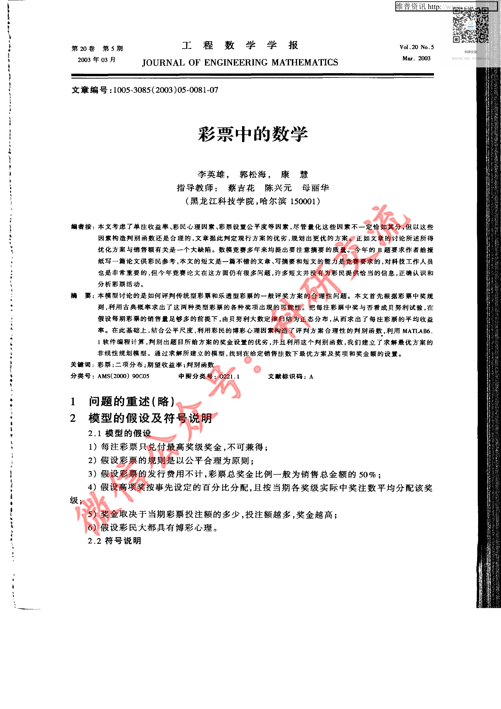
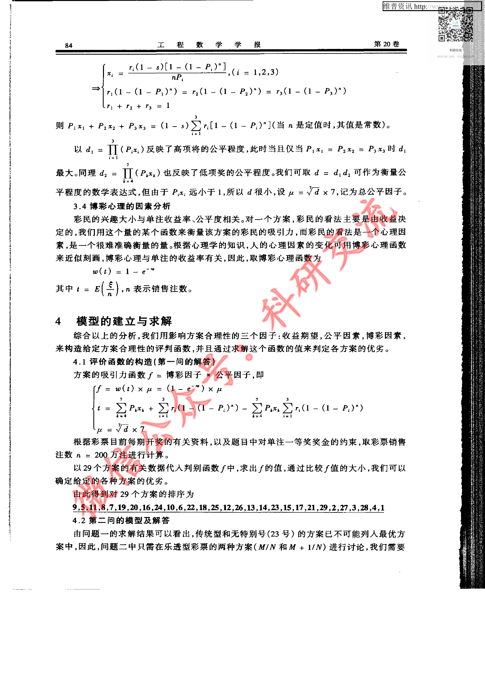
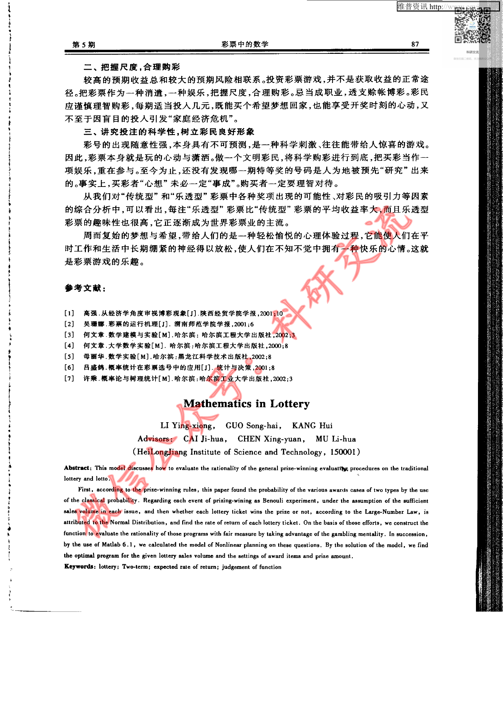

# Before / After Evidence — CUMCM-2002-B-005

This is an evidence comparison for the original G11 MAJOR finding. It is not a human decision.

## Original defective state (historical authoritative evidence)

- Original decision sheet: `catalog/scale/g11_manual_sample_decisions.csv`; sample_order `30`; severity `MAJOR`.
- Historical body SHA256 before repair: `845EAC42B8D7C797245E742A556F6F7B87F8594979C758FB43031CD6D48DB563`.
- Historical packet: `reports/scale/g11_manual_sample_review/30_CUMCM-2002-B-005`.
- Original major evidence: 源页面包含彩票模型正文和公式，artifact excerpt只保留页标记、没有实质文本，存在明显大段正文缺失。

### Historical review unit G11-MANUAL-SAMPLE-30-PAGE-A

- Historical source render: `reports/scale/g11_manual_sample_review/30_CUMCM-2002-B-005/page_A.png`.
- Historical formal excerpt: `reports/scale/g11_manual_sample_review/30_CUMCM-2002-B-005/page_A_artifact_excerpt.txt`.
- Historical page-content SHA from triage: `E3B0C44298FC1C149AFBF4C8996FB92427AE41E4649B934CA495991B7852B855`.

<pre>
paper_id=CUMCM-2002-B-005
page_number=1
page_classification=FIRST_PAGE_FROM_FROZEN_PAGE_COUNT
source_path=2002年数学建模国赛真题+优秀论文/2002年优秀论文/2002B：彩票中的数学.pdf
source_sha256=FA279E682B35EA23D320073F6818B6DA538A4AE5BC86B6D86A0D384FE8E6A06F
persisted_page_text_path=NOT_AVAILABLE_FOR_THIS_STRATUM

=== PERSISTED PAGE TEXT (READ-ONLY EXISTING EVIDENCE) ===
[No page-local persisted text is available; no new extraction was run.]

=== FORMAL ARTIFACT CONTEXT WINDOW ===
# Extracted Paper

<!-- source_page: 1 -->

<!-- source_page: 2 -->

<!-- source_page: 3 -->

<!-- source_page: 4 -->

<!-- source_page: 5 -->

<!-- source_page: 6 -->

<!-- source_page: 7 -->

=== HUMAN REVIEW NOTE ===
This file prepares evidence only. It is not a human review decision.

</pre>

### Historical review unit G11-MANUAL-SAMPLE-30-PAGE-B

- Historical source render: `reports/scale/g11_manual_sample_review/30_CUMCM-2002-B-005/page_B.png`.
- Historical formal excerpt: `reports/scale/g11_manual_sample_review/30_CUMCM-2002-B-005/page_B_artifact_excerpt.txt`.
- Historical page-content SHA from triage: `E3B0C44298FC1C149AFBF4C8996FB92427AE41E4649B934CA495991B7852B855`.

<pre>
paper_id=CUMCM-2002-B-005
page_number=4
page_classification=MIDDLE_PAGE_FROM_FROZEN_PAGE_COUNT
source_path=2002年数学建模国赛真题+优秀论文/2002年优秀论文/2002B：彩票中的数学.pdf
source_sha256=FA279E682B35EA23D320073F6818B6DA538A4AE5BC86B6D86A0D384FE8E6A06F
persisted_page_text_path=NOT_AVAILABLE_FOR_THIS_STRATUM

=== PERSISTED PAGE TEXT (READ-ONLY EXISTING EVIDENCE) ===
[No page-local persisted text is available; no new extraction was run.]

=== FORMAL ARTIFACT CONTEXT WINDOW ===
e: 3 -->

<!-- source_page: 4 -->

<!-- source_page: 5 -->

<!-- source_page: 6 -->

<!-- source_page: 7 -->

=== HUMAN REVIEW NOTE ===
This file prepares evidence only. It is not a human review decision.

</pre>

### Historical review unit G11-MANUAL-SAMPLE-30-PAGE-C

- Historical source render: `reports/scale/g11_manual_sample_review/30_CUMCM-2002-B-005/page_C.png`.
- Historical formal excerpt: `reports/scale/g11_manual_sample_review/30_CUMCM-2002-B-005/page_C_artifact_excerpt.txt`.
- Historical page-content SHA from triage: `E3B0C44298FC1C149AFBF4C8996FB92427AE41E4649B934CA495991B7852B855`.

<pre>
paper_id=CUMCM-2002-B-005
page_number=7
page_classification=LAST_PAGE_FROM_FROZEN_PAGE_COUNT
source_path=2002年数学建模国赛真题+优秀论文/2002年优秀论文/2002B：彩票中的数学.pdf
source_sha256=FA279E682B35EA23D320073F6818B6DA538A4AE5BC86B6D86A0D384FE8E6A06F
persisted_page_text_path=NOT_AVAILABLE_FOR_THIS_STRATUM

=== PERSISTED PAGE TEXT (READ-ONLY EXISTING EVIDENCE) ===
[No page-local persisted text is available; no new extraction was run.]

=== FORMAL ARTIFACT CONTEXT WINDOW ===

<!-- source_page: 7 -->

=== HUMAN REVIEW NOTE ===
This file prepares evidence only. It is not a human review decision.

</pre>

## Current repaired state (read-only current formal evidence)

### Current source page 1

- Current formal excerpt: `reports/scale/g11_post_repair_human_rereview/11_CUMCM-2002-B-005/current_formal_p1.md`.
- Current page segment SHA256: `911C5A1368413DC50E7A66A815441B879E7FE00E5322E8AE94F6730EBD00135D`.
- Raw current excerpt SHA256: `B9E9989A0A4838622B5D8EA5F87A2E874ABB5A5D387139AB93F5DCD555BC85B1`.
- Repair evidence: `catalog/scale/g11_residual_pdftotext_calibration/positive/CUMCM-2002-B-005/source_page_1.txt`; evidence SHA256 `8CFFDE1E18158FC6534AFB6EDC9F6B248E147070D2987D48839451A0ACE7BE24`.
- Programmatic repair validation: `postrepair_pass=1`.

### Current source page 4

- Current formal excerpt: `reports/scale/g11_post_repair_human_rereview/11_CUMCM-2002-B-005/current_formal_p4.md`.
- Current page segment SHA256: `47E0FFA95AFF7FCECFF78CDE5099AD4AC867DA1F811315807DF213FD886967D6`.
- Raw current excerpt SHA256: `D45271047B50EDEE86AA29E1B0E6D924132432CFC218DDD0C4052A884916B55B`.
- Repair evidence: `catalog/scale/g11_residual_pdftotext_calibration/positive/CUMCM-2002-B-005/source_page_4.txt`; evidence SHA256 `D5E6B1D6855D743D7F0F65DE4192052782A5C5CC6446A4065178EEAA3E799988`.
- Programmatic repair validation: `postrepair_pass=1`.

### Current source page 7

- Current formal excerpt: `reports/scale/g11_post_repair_human_rereview/11_CUMCM-2002-B-005/current_formal_p7.md`.
- Current page segment SHA256: `9C2C1E73E91AC8B844B2D9FEA54D06AAA55032DF54CCFE9F9879F8E252B43223`.
- Raw current excerpt SHA256: `5E61FD21C3B380199F76C60FC30476AABB9FFA9C4C8B5ACEE14B06739F989C29`.
- Repair evidence: `catalog/scale/g11_residual_pdftotext_calibration/positive/CUMCM-2002-B-005/source_page_7.txt`; evidence SHA256 `C3575E2D7E3F2569A335DA9750A555717BDAA2EE4CC64F4519494FD1ED03B758`.
- Programmatic repair validation: `postrepair_pass=1`.

The historical block is linked to the original packet evidence; the current block is extracted from the current formal `paper.md`. Human reviewers must compare the original issue with the repaired content and decide the new severity independently.

## Source Page Images

Existing historical source-render copies for the corresponding rereview units:

- `G11-MANUAL-SAMPLE-30-PAGE-A` / source page `1`: 
  - Original PNG: `reports/scale/g11_manual_sample_review/30_CUMCM-2002-B-005/page_A.png`; SHA256 `4C4CAC4018E68A7B84E3769A3F6039ACCB5CAD90C46CEA8F37761F58A7B79D39`.
  - Copied PNG: `source_images/source_unit_01_p1.png`; SHA256 `4C4CAC4018E68A7B84E3769A3F6039ACCB5CAD90C46CEA8F37761F58A7B79D39`.
- `G11-MANUAL-SAMPLE-30-PAGE-B` / source page `4`: 
  - Original PNG: `reports/scale/g11_manual_sample_review/30_CUMCM-2002-B-005/page_B.png`; SHA256 `3BBEF1A1A4FA0E5B16E2E065C7B6F6C18AE9726C9BCA517771D2568D64195D17`.
  - Copied PNG: `source_images/source_unit_02_p4.png`; SHA256 `3BBEF1A1A4FA0E5B16E2E065C7B6F6C18AE9726C9BCA517771D2568D64195D17`.
- `G11-MANUAL-SAMPLE-30-PAGE-C` / source page `7`: 
  - Original PNG: `reports/scale/g11_manual_sample_review/30_CUMCM-2002-B-005/page_C.png`; SHA256 `BA5D3352482A3776C0739C21CEE7B4A1DC7EBBC9CFD1C8FDD4246B0EB9FD16F7`.
  - Copied PNG: `source_images/source_unit_03_p7.png`; SHA256 `BA5D3352482A3776C0739C21CEE7B4A1DC7EBBC9CFD1C8FDD4246B0EB9FD16F7`.
